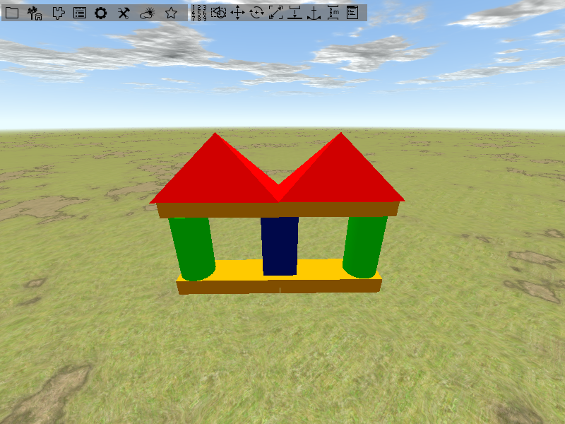
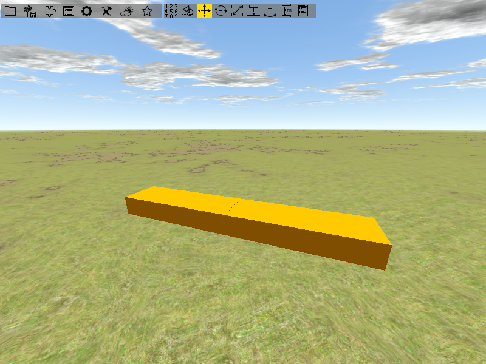

<!------------------------------------------------------------------------------------------------
This work is licensed under the Creative Commons Attribution-ShareAlike 4.0 International License.
 To view a copy of this license, visit http://creativecommons.org/licenses/by-sa/4.0/.
 Author: Florian Pieper (fpieper@mail.uni-paderborn.de)
 PADrend Version 1.0.0
------------------------------------------------------------------------------------------------->
<!---BEGINN_INDEXSECTION--->
<!---Automaticly generated section. Do not edit!!!--->
# Overview
* 2 User Guide
    * 2.1 [Scene loading and navigation](../../2_User_Guide/1_Scene_loading_and_navigation/Scene_loading_and_navigation.md)
    * 2.2 [Scene Building](../../2_User_Guide/2_Scene_Building/Scene_Building.md)
    * 2.3 [Basic Animation](../../2_User_Guide/3_Basic_Animation/Basic_Animation.md)
    * 2.4 [Functional Objects and Physics](../../2_User_Guide/4_Functional_Objects_and_Physics/Functional_Objects_and_Physics.md)
    * 2.5 [Functional Objects Pointing Joint](../../2_User_Guide/5_Functional_Objects_Pointing_Joint/Functional_Objects_Pointing_Joint.md)
    * 2.6 [Using Scripts](../../2_User_Guide/6_Using_Scripts/Using_Scripts.md)
    * 2.7 [Object Factories](../../2_User_Guide/7_Object_Factories/Object_Factories.md)
    * 2.8 [Camera Path](../../2_User_Guide/8_Camera_Path/Camera_Path.md)
<!---END_INDEXSECTION--->

# Goal of this tutorial
In this tutorial you will learn some basic techniques for building and manipulating a scene.
We want to build a small building from toy blocks.
The image below shows you how it is about to look like in the end.

# Assumption
Tutorial 1 is finished.
PADrend is opened and an empty scene is loaded.
Infinite ground and dynamic sky are enabled.

# Adding toy blocks to the scene
Before we start, first activate the toolbar by pressing [F2].
Navigate to a position a bit above the ground, looking down in a slight angle.
Activate the _Scene Editor Window_  by either using the _Scene Editor Window_ entry of the toolbar or by pressing [F2] again.

You are faced with a window containing of two the two tabs _Object explorer_ and _ObjectPlacer_.
Right now we are only interested in the _ObjectPlacer_.
Before we can add objects to the scene, we need to add them to the _ObjectPlacer_.

Make sure the toy blocks files (see [toy blocks](../models/ToyBlocks.zip)) are located in PADrend's data folder.
In the _ObjectPlacer_ click on add library.
In the dialog choose the location of the toy blocks and hit _Confirm_.

You should now find the toy blocks in the _ObjectPlacer_.

You can add a new toy block via drag and drop.
Click on _toyblock1_ and hold down the left mouse button.
Drag to the position on the ground where you want to place the toy block and release the mouse button.
Add some more toy blocks to the scene (e.g. one of each kind) and close the _Scene Editor_ for now.

# Node selection
In PADrend parts of the geometry (e.g. a single tree) are seen to be nodes within a hierarchical scene-graph.
Nodes can be manipulated in different ways (e.g moving them or resizing them).

You may have noticed that there is a white bounding box around the last node you have added.
It shows you that the node is currently selected.
You can only manipulate nodes that are selected, but how can you select a node?
The simplest way how you can select a single node is to press and hold the control key (ctrl) and click on the node you want to select.
Again a transparent white bounding box will appear around the node, showing you that it is now selected.
Also a black description field will appear above the node.
It provides you with information about the node.
In our case you should see the instance of the node, the node type (here GeometryNode) and the number of triangles it consists of.
If you want to select more than one node also hold down the shift key and click on another node.
To unselect perform a right click on the scene and choose _Unselect all_ from the _Select Node_ context menu.
Another way of selecting nodes via mouse is by using the selection tool.
You can find the selection tool in the toolbar.

With help of the tool you can select nodes by pulling a rectangle with the mouse, similar as if you would select files in your file browser.
You can choose between two settings via the _Mode_ item of context menu (perform a right click on the scene).
The first mode selects all nodes that are either fully contained within or intersect the rectangle.
The second one only select nodes that are fully contained  within the rectangle and ignores intersecting ones.
Use both modes to select a set of the toy blocks to get a feeling of how they differ.
Activate one of the settings and try to select some nodes.
If you want to select some nodes in addition hold down shift and select them.
For unselecting some nodes hold down _alt_ and use the rectangle to determine which to deselect.  

You can also use the context menu to select nodes.
Open it by a right click on the scene.
Open _Select Node_ and choose either the root node or a child from the children list.
With the children list you can traverse the scene-graph node by node.

# Building a house
First of all we need to clean up the scene.
Select all toy blocks and delete them by pressing [del].
Notice: this operation can not be undone by [ctrl] + [z].
Let's start with the baseplate.
Open the _Scene Editor_ and add two instances of _toyblock4_ to the scene.

## Snap moving tool
To move nodes snapped to the ground you can use the snap moving tool.
It has two modes which will be explained in the following.
You can switch between them by opening the context menu and checking or unchecking _Snap geometry (slow)_ .
Select one of the toy blocks and check _Snap geometry (slow)_.
You should be faced with an red arrow, pointing to the selected node and a circle above it.
If you want to move the node, click on the circle and move the mouse.
You will notice that the node always sticks to the ground while you move it.
Try to move the node towards the other toy block.
It will go through it.
Now lets use the arrow.
Position the toy block in front of the other one.
Click on the arrow and pull it upwards until it is higher than the toy block.
If you now move the toy block towards the other one it will jump onto it.
This may help you if you want to place a node on top of another one.
The hight of the arrow restricts the hight of the lower node.
If you click on the arrow and push it down the ground level will lower.

The second mode works in a different way.
Uncheck _Snap geometry (slow)_ and you will be faced with an downwards pointing arrow.
Click on it and move the mouse.
This will again move the node.
You may have noticed that the cone of the arrow is pretty wide.
If you move the node towards another node it will start to move onto the node as soon as the cone touches the other node.
When the tip of the cone is on top of the other node, the node will also be placed on top of it.

Let's get back to the baseplate of our house.
Use the snap moving tool to place the toy blocks beside each other.
Try to keep the gap between them as small as possible and pay attention to their alignment.
You may need to need to view the blocks from different viewpoints.

Next up we need to cylinders for the right and left side.
Drag two instances of _toyblock3_ into the scene.
Again use the snap moving tool to place them.
The image below shows you how the cylinders should be placed.

## Rotation tool
Now we need the middle part of the house.
Drag an instance of _toyblock5_ into the scene.
You may have noticed that its orientation differs form the way we need it.
So it needs to be rotated.
Select the rotation tool.
You will see a coordinate cross with three rings around it.
The rings are the three rotation axis.
The center of the coordinate cross defines the center of rotation which is called pivot point.
By default it is set to the middle of the node so that the node rotates around its center.
If you pull one axis of the cross with the mouse you can change the pivot point along this axis.
You may have also noticed the three quarter circles, each connecting two axis of the coordinate cross.
They can be used to move the pivot point along the two axis they connect at the same time.
You can also alter the pivot point by item pivot of the context menu.
You can choose the pivot point relative to the nodes coordinate system or to the nodes bounding box.
For our toy block we choose the pivot to be [1, 0.5, 0.5] relative to the bounding box.

To rotate a node you grab one of the circles which are located around the pivots coordinate cross and pull it.
As you start to rotate another black box will appear.
It provides you with information about the rotation, which are basically the angle you have already rotated the node and the coordinate of the pivot point.
You will notice that the rotation is executed in steps.
By default the step size is set to 1 degree.
We need to rotate the toy block 90 degrees along the green rotation axis.
Use the context menu and set the _Step size_ to 90 by typing in the value.
Rotate the toy block by pulling the green axis to the outside of the block.
Afterwards apply another 90 degree rotation along the blue axis in an arbitrary direction.
Now the toy block is rotated to the correct orientation.
Place it between the cylinders by using the snap moving tool.

Next up we again need two instances of _toyblock4_.
Use the snap moving tool to place them on top of the cylinders.
You do not have to care about the alignment right now.

## Translation tool
Let's do the alignment.
Choose one of the toy blocks you have just added and activate the translation tool.
You will be faced with a coordinate cross similar to the one for altering the pivot point in the rotation tool.
This time you can use it to translate a node.
Use the mouse to pull along the blue axis until the toy block is aligned with the cylinder.
Then use the red axis until the yellow block aligns with the middle of the blue block.

Use the same technique on the other yellow toy block.

## Scaling tool
We are almost done.
The only thing that is still missing is the roof.
Drag out two instances of _toyblock2_ and place them at the left and right side on top of the house.

They are a bit to small to cover the whole roof area.
So we need to scale them.
Select one of the roofs and activate the scaling tool.
You will be faced with some cones around the currently selected node.
The cones show the direction of the scaling.
When you for example choose the cone on the top of the node it will change its size to the top and also to the sides but its bottom stays on the ground.
There are two cones at the corners of the bounding box that point towards the middle of the house and also point upwards in an angle.
Choose one of them and pull it towards the middle of the house until the roof covers about one half of the house.
Apply the same on the second toy block of the roofs until both touch each other.

If you take a look at the house from the side you will notice, that the roofs do not align with the middle of the house.

Fix it by using the translation tool and the house is finished.

## Saving the scene on disk
Go to the _File_ menu and choose _Save scene as_.
A dialog appears asking you for a filename.
Type in a filename you like and hit confirm.

## Duplicating the house
Assume you want to have several houses.
One way to do it would be building them one by one.
But we have already build one and it was quiet some work.
So it is better to take the one that we have and duplicate it.
First we need to put all toy blocks together in a common subtree of the scene graph.
Select all toy blocks and open the context menu.
Go to _Node tools_ and open the _Tree tools_ menu.
Choose _Group nodes in common subtree_.

In stead of having a bounding box around each single toy block there should now be a bounding box around the whole house.

But you are still able to select the single toy blocks within the house.
Select one of them.
You can use [pgUp] and [pgDown] to traverse through the scene graph level wise.
Use [pgUp] to traverse one level up and you will reach the houses node we have just created.
Use [pgDown] to traverse one level down so that each child node gets selected.
In case of the house that means that all the toy blocks get selected.
Traverse back to the common node.
To duplicate the house press [ctrl] + [d].
Now you have a duplicate stored in the main memory.
To add it to the scene press [ctrl] + [v].
The duplicate will be added at the position of the original house.
To separate both use one of the translation tools.
Create some houses.

If you want to copy a house from one scene to another select the house and press [ctrl] + [c].
Change the scene and use [ctrl] + [v] to paste it.
