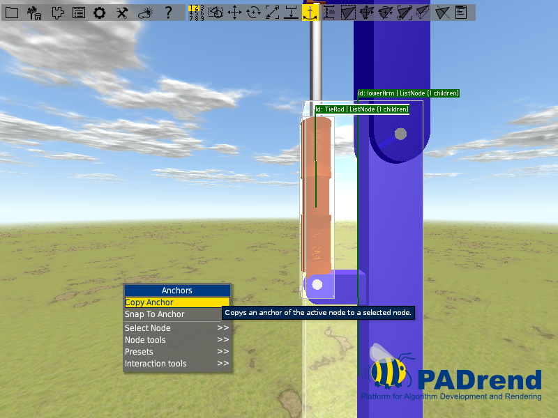

<!------------------------------------------------------------------------------------------------
This work is licensed under the Creative Commons Attribution-ShareAlike 4.0 International License.
 To view a copy of this license, visit http://creativecommons.org/licenses/by-sa/4.0/.
 Author: Florian Pieper (fpieper@mail.uni-paderborn.de)
 PADrend Version 1.0.0
------------------------------------------------------------------------------------------------->
<!---BEGINN_INDEXSECTION--->
<!---Automaticly generated section. Do not edit!!!--->
# Overview
* 2 User Guide
    * 2.1 [Scene loading and navigation](../../2_User_Guide/1_Scene_loading_and_navigation/Scene_loading_and_navigation.html)
    * 2.2 [Scene Building](../../2_User_Guide/2_Scene_Building/Scene_Building.html)
    * 2.3 [Basic Animation](../../2_User_Guide/3_Basic_Animation/Basic_Animation.html)
    * 2.4 [Functional Objects and Physics](../../2_User_Guide/4_Functional_Objects_and_Physics/Functional_Objects_and_Physics.html)
    * 2.5 [Functional Objects Pointing Joint](../../2_User_Guide/5_Functional_Objects_Pointing_Joint/Functional_Objects_Pointing_Joint.html)
    * 2.6 [Using Scripts](../../2_User_Guide/6_Using_Scripts/Using_Scripts.html)
    * 2.7 [Object Factories](../../2_User_Guide/7_Object_Factories/Object_Factories.html)
<!---END_INDEXSECTION--->

# Goal of this tutorial
This is a further tutorial on functional objects.
We want to animate a part of a diggers arm containing of a joint and a hydraulic cylinder.
In detail we want to work rotations to animate the arms movement and make use of pointing joints to animate the hydraulic cylinder.  

# Assumptions
All previous tutorial are finished.
PADrend is opened and the scene _tut5_scene.minsg_ (see [tut5_scene](scene/tut5_scene.minsg)) is loaded.
Infinite ground and dynamic sky are enabled.
The _ObjectFactories_ plugin is activated.

# Adding rotation to the main joint
We start this tutorial by animating the rotation of the arm around the main joints axis.
Open the object placer and drag out a _Functional/RotationAxis_.
Place it somewhere on the ground not too far away from the arm.
Give it some name like _mainJointRotationAxis_.
Rotate it by 90 degrees around the x-axis.

Next up we need to align the rotation axis with the main joints axis.
Thankfully PADrend provides us with a functionality that can do the job.
To use this functionality it is very important to select the node that should be aligned and the node that is used for the alignment in the correct order.
Select first the node that should be aligned.
In our case this is the rotation axis.
Afterwards select the second node.
We want to align the rotation axis to the main joints axis.
First select the rotation axis.
Than hold down the [shift] key and select node _midJointAxis_.
Now both nodes should be selected.

Right click to open the context menu.
Select _Node Tools_ and than _Alignment_.
You will find some menu points and a combobox.
You can use the combobox to choose an alignment position within the second node.
Make sure that _BB center_ is selected.

Click on common position and the rotation axis will be aligned to the joint axis.  
Next up create a link between the rotation axis and the node _upperArm_.
Use _transformSnapOffset_ as role name.
Test if the rotation works correctly by rotating the rotation axis.

# Animating the hydraulic cylinder
For the animation of the hydraulic cylinder we use the _Animation/PointingJoint_ object trait.
The trait can be used to align a node between two anchor points.
One of the anchor points is the mount anchor point.
The nodes top will snap to it.
The second anchor point is the target anchor point.
The nodes bottom will align to it.
When one of the anchor points gets moved by some transformation the node will also move to keep its alignment to the two anchor points.  

## Creating the anchors
First we need to create the anchor points.
Select the anchor tool from the toolbar.
Select the node named _TieRod_.
Open the context menu by a right click.
Select _New Anchor_, name it _lowerMountPoint_ and click _Create_.

Next up the anchor needs a position.
Open the context menu again and locate _[lowerMountPoint]_.
Search for _Positon (relative to bb)_ to position it relative to the nodes bounding box.
Type in [0.5, 0, 0.5] and press return.

We do not need the anchor point at the _TieRod_ but we need it at the _lowerArm_.
However we created it at the _TieRod_ since it makes the positioning much easier.
In the next step we copy the anchor from the _TieRod_ to the _lowerArm_.
In order to copy the anchor we need to select both nodes.
Since the nodes are stored on different levels of the scene graph it is useful to store each selection individually.

### Using the selection store tool
You may have already noticed that there are numbers form one to nine in the toolbar.
This numbers can be used to store selections.
If you have selected one or more nodes and you know that you need the same selection later on, you can store your selection.
Select a node.
To store your selection simply click on the number you want to use.
You can also press [ctrl] followed by one of the keys [0] ... [9].
The numbers that store a selection will be highlighted.
To overwrite a stored selection you can either use the keyboard method the keyboard like before or you right click onto a number and hit _Store Selection_.
If you want to use your stored selection click on the number you have stored it or hit the number on your keyboard.
Hitting the number twice will focus the node.

### Coping the anchor

Make sure the anchor tool is still active.
Store the selection of each node.
To use the copy tool it is again important to select the nodes in the correct order.
Use your stored selection and select first _lowerArm_ then hold down shift and select _TieRod_.
Open the context menu by a right click and select _Copy Anchor_.

A window will appear.
Use the combobox _Source Anchor_ to select the anchor you want to copy.
With use of the textfield _Target Anchor_ you can change the name of the anchor that will be created at the target node.
Hit copy and the anchor will be copied.

In the same manner create an anchor for the node _piston_.
Name it _upperMountPoint_ and position it at [0.5, 1, 0.5] relative to the bounding box.
Copy it to node _upperArm_.

## Creating the pointing joint animation
To ensure the animation to work correctly, we use position proxies to build up the pointing joint animation.
The hydraulic cylinder itself will be connected to them later in a later step.  
Drag out two position proxies and name one _upperMount_ and the other one _lowerMount_.
Let us start with the _upperMount_ proxy.
Select it in the object explorer and add an _Animation/PointingJoint_ object trait to it.

The trait provides you with two comboboxes which you can use to choose the mount and target anchor point.
The trait also provides two link roles to connect the nodes that contain the both anchor points.
Connect node _upperArm_ via link role _mountAnchor_ to the proxy.
Next up connect node _lowerArm_ to the proxy by using the link role _targetAnchor_.

You should now find the anchor point _upperMountPoint_ in the combobox _mountAnchorId_ and the anchor point _lowerMountPoint_ in the combobox _targetAnchorId_.
The position proxy should now be snapped to the anchor point _uppermount_.
Select both anchors via the comboboxes.

Do the same for the _lowerMount_ position proxy, but change the order of the links.
Link role _mountAnchor_ is now connected to _lowerArm_ and _targetAnchor_ to _upperArm_.  
Next up we connect the hydraulic cylinder to the position proxies.
Connect the _upperMount_ proxy to the nodes _Piston_ and _pistonJointAxis_ and the _lowertMount_ proxy to the nodes _TieRod_ and _tieRodJointAxis_.
Use _transformSnapOffset_ as link role.

Try out if every thing works correctly.
Pick the _mainJointRotationAxis_ and rotate it.
The hydraulic cylinder should align to both mount points and move like a real hydraulic cylinder.
The arm should rotate around its joint axis.
Undo your rotation after trying.

# Adding an animator
To get the animation running we need to add an animator.
Open the object placer and drag out a _Functional/ConstraindeMotor_ object.
Restrict the maximum time of the motor to 2.
Open the _mainJointRotationAxis_ in the object explorer and connect it to the motor via a link.
Set the rotation to 30 degrees per second.
Start the motor to try out if everything works correctly.
If the arm rotates in the wrong direction set the rotation to -30 degrees per second

