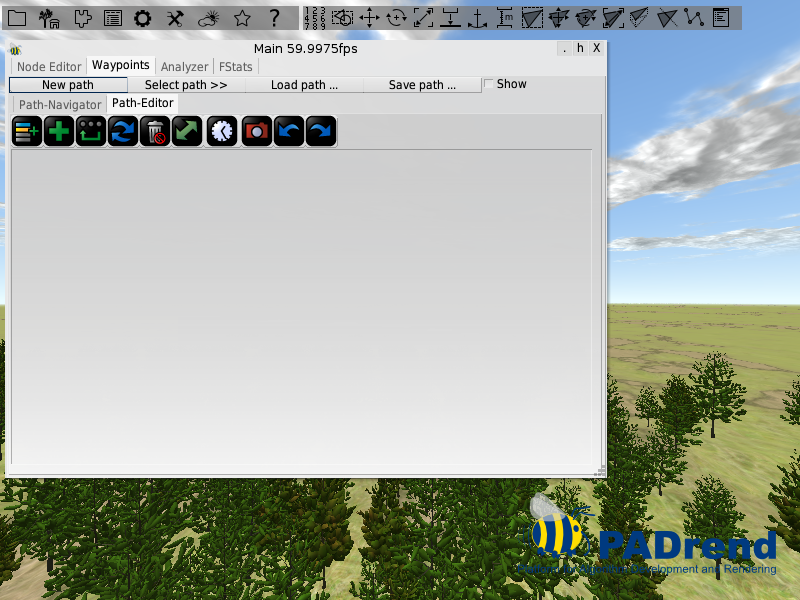

<!------------------------------------------------------------------------------------------------
This work is licensed under the Creative Commons Attribution-ShareAlike 4.0 International License.
 To view a copy of this license, visit http://creativecommons.org/licenses/by-sa/4.0/.
 Author: Florian Pieper (fpieper@mail.uni-paderborn.de)
 PADrend Version 1.0.0
------------------------------------------------------------------------------------------------->
<!---BEGINN_INDEXSECTION--->
<!---Automaticly generated section. Do not edit!!!--->
# Overview
* 2 User Guide
    * 2.1 [Scene loading and navigation](../../2_User_Guide/1_Scene_loading_and_navigation/Scene_loading_and_navigation.html)
    * 2.2 [Scene Building](../../2_User_Guide/2_Scene_Building/Scene_Building.html)
    * 2.3 [Basic Animation](../../2_User_Guide/3_Basic_Animation/Basic_Animation.html)
    * 2.4 [Functional Objects and Physics](../../2_User_Guide/4_Functional_Objects_and_Physics/Functional_Objects_and_Physics.html)
    * 2.5 [Functional Objects Pointing Joint](../../2_User_Guide/5_Functional_Objects_Pointing_Joint/Functional_Objects_Pointing_Joint.html)
    * 2.6 [Using Scripts](../../2_User_Guide/6_Using_Scripts/Using_Scripts.html)
    * 2.7 [Object Factories](../../2_User_Guide/7_Object_Factories/Object_Factories.html)
    * 2.8 [Camera Path](../../2_User_Guide/8_Camera_Path/Camera_Path.html)
<!---END_INDEXSECTION--->

# Creating camera paths using the user interface
Camera paths allow you to animate the camera along a predefined path.
There are mainly two cases in that you can use camera paths
First of all they come in handy if you want to evaluate your algorithms, since you can be sure to get the same perspective in every test run.
But you can also use them in presentations.
PADrend will move the camera smoothly along the path, which can create an impressive animation for the audience.  
There are two ways to create a camera path.
You can either do it by some script or you can use a UI tool.

## In this tutorial
This tutorial shows how to build up camera paths by using the UI tool.

## Preparation
Before you can start you must make sure if the _Waypoints_ plugin is activated.
The image below shows you where to find it.
If it is already activated, you are good to go.
Otherwise activate the plugin and restarted PADrend to make sure that it gets loaded.

## Create a path
We want to create a camera path in scene_1, so first of all load the scene.
Use [F1] to open the main window.
In the main window you should find a _Waypoints_ tab.
Go ahead and open it.
Your window should look like in the image below.

In the top you are provided with four buttons and a check box.

* _New path_ : creates a new camera path and selects it.
* _Select path >>_ : shows you all paths that are currently available. You can select a specific one by clicking on it.
* _Load path ..._ : Loads a path from a file.
* _Save path ..._ : Save a path to a file.
* _Show_ : Shows the currently selected path in the scene. For each way point there is an arrow showing the direction and position of the camera. The way points are connected by a line indicating their order.

Underneath the buttons there are two tabs (_Path-Navigator_ and _Path-Editor_) which will be discussed in the following.

### Path editor
The image below shows the path editor.

It offers you some functionality to create and edit camera paths.
Lets start by adding the first way point.
Navigate to a position at which you want to create it and hit the green plus.
A new way point will show up in the list under the buttons.
As mentioned before, each way point defines a camera position and direction.
If you create a new way point, it will copy the current camera position and store it.

Create some more way points with different camera positions.
Note that the button with the green plus item will always add a way point to the end of the list.
If you want to create a way point somewhere inbetween, select a way point and hit the left most button.
The new way point will be created directly under the selected one.  
The third button for adding a new way point is the one with the three dots and an arrow.
It creates a way point that closes the path, so that we end in the start position.

You can use the trash button to delete all selected way points.
The green arrow will change the order of two selected way points.
There are also two buttons for undo and redo as well as a button for refreshing the view.
The camera button will save a screenshot for each way point.  
So far for the buttons.
There is only one left which will be explained in more detail.
It is the one with the clock on it.
You may have noticed that each way point gets a number attached to it.
However these numbers are not identifiers but times.
In the image above you can see that the first way point has time 0.
If we animate the path it will be reached after 0 seconds.
The next one will be reached after 1 second and the third one after 1.5 seconds and so on.
Also we can adapt the time of a way point by hand (which will be described later) the clock button allows you to automatically recalculate them.
If you click on it you will be faced with the image below.

The first entry, _Set to indices_, will simply set the time stamps to increasing numbers (1, 2, 3, ....).
The second entry calculates time stamps based on the distance between two way points.
You can adapt the calculated value by the number above the _Calculate_ button.
The higher the number, the lower the difference in time, which leads the camera to move faster.
Hence two way points have a distance of 14 and the first one has time stamp 0.
If you set the number to 2 the second way point will get a time stamp of 7, while if you set it to 0.5 the second way point will get a time stamp of 28.

#### Editing way points
You may have noticed that there are also two buttons attached to each way point.
The first button (the one with the yellow arrow) is used to "fly" to that way point.
If you hit it, the camera will move from its current position to the way points position and orientation in an animation.  
The second button opens the edit view of the way point.
If you hit it you should see a view similar to the one in the image below.

You should see two text fields and three buttons.
With the first text field you can change the time stamp by hand.
You can attach an additional description (for example a name or what you can see from that way point) to the way point by using the second text field.
If you hit the first button, the way points position and orientation will be set to the current cameras viewport.
The last two buttons are self describing.
_Cancel_ discards the change you did, while _Save_ applies them to the way point.

### Path navigator
Now that you have created some way points open the _Path Navigator_ by clicking on its tab.
It should contain all your way points and looks similar like in the image below.

You can use the forward and backward buttons to move from one way point to the next or previous one.
The play button starts an infinite animations, which runs through the way points in their order.
With either the slider or the text field next to it you can go to a specific point in time.
This allows you to also explore positions that are located inbetween two way points.
In the settings menu next to the text field you find two entries.
If you hit the first one, each way point entry (the ones under the controls) will get a screenshot from its perspective attached to it.
With the second entry you can change the speed of the animation.
To move to a specific way point simply click on it.
