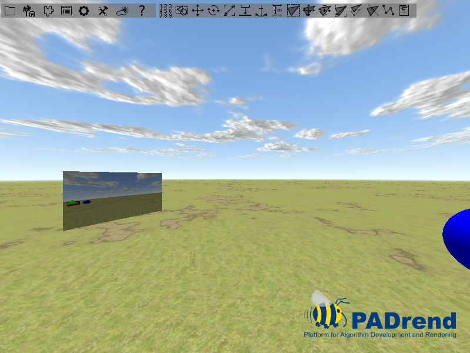

<!------------------------------------------------------------------------------------------------
This work is licensed under the Creative Commons Attribution-ShareAlike 4.0 International License.
 To view a copy of this license, visit http://creativecommons.org/licenses/by-sa/4.0/.
 Author: Florian Pieper (fpieper@mail.uni-paderborn.de)
 PADrend Version 1.0.0
------------------------------------------------------------------------------------------------->
<!---BEGINN_INDEXSECTION--->
<!---Automaticly generated section. Do not edit!!!--->
# Overview
* 3.1.4 Rendering
    * 3.1.4.1 [MeshBuilder](../../../../3_Development_Guide/1_EScript/4_Rendering/1_Mesh_Builder/MeshBuilder.md)
    * 3.1.4.2 **RenderToTexture**
<!---END_INDEXSECTION--->

# Goal of this tutorial
This tutorial shows an example usage of frame buffer objects.
Frame buffer objects can be used to render a scene to a texture.

# Frame Buffer Object (FBO)
If you use PADrend out of the box, it will render to the screen.
But in some cases it is necessary to render to a different target, such as a texture.
For this purpose an additional frame buffer object can be used.
A texture is bind as rendering target of the new FBO, so that after the FBO was used for rendering the output can be read from the texture.  
Before a FBO can be used it first needs to be bound to the rendering context.
In the next rendering pass it will be used as rendering target.
If it is no longer needed, the FBO has to be removed from the rendering context.
This results in rendering to the previously used FBO (e.g. the standard one that renders to the screen).

# In this tutorial

In this tutorial we will build a mirror using a FBO.
The rendering is done in two steps.
In the first step the scene get mirrored.
A FBO is used to render the mirrored scene to a texture.
The mirror will be deactivated for this step, so that it is not rendered to the texture.
Otherwise we may see the mirror inside the mirror, which would be wrong.
In the second step the scene is rendered to the screen.
The texture, created in the first step, is rendered to a rectangle, which creates the mirror effect.  
Lets take a look at the code step by step.

## Initializing the frame buffer Object
The first thing we need to do is creating a frame buffer object and binding a texture to it.

<!---INCLUDE src=RenderToTexture.escript, start=19, end=26--->
<!---BEGINN_CODESECTION--->
<!---Automaticly generated section. Do not edit!!!--->
    this.fbo := new Rendering.FBO();
    this.mirrorTexture := Rendering.createStdTexture(renderingContext.getWindowWidth(), 
                                                    renderingContext.getWindowHeight(),
                                                    true);
    renderingContext.pushAndSetFBO(this.fbo);
    this.fbo.attachColorTexture(renderingContext, this.mirrorTexture);
    renderingContext.popFBO();
    Rendering.checkGLError();
<!---END_CODESECTION--->

A frame buffer object is created by an object instantiation.
The texture is created by the function _Rendering.createStdTexture_.
We size the texture in the same size as PADrend's main window.
Passing _true_ as last parameter causes the texture to use the alpha channel.  
In the next step we need to bind the texture to the frame buffer object.
Therefore we first need to activate the frame buffer object.
The method _pushAndSetFBO_ pushes our FBO to the stack of FBO's of the rendering context and activates it.
Next up we use _attachColorTexture_ to bind the texture to the FBO.
You can also add a depth texture or a depth stencil texture to the FBO by calling _attachDepthTexture_ or _attachDepthStencilTexture_.
Since we do not need a depth texture here, this step is skipped.
After that we pop the FBO from the stack, which also deactivates it and check for errors.

## Building a test scene
The test scene is made from a box, a sphere and a cone.
The texture is mapped to a simple quad.
To attach the texture to the quad, a texture state is added to to node holding the quad.
Whenever the quad is rendered, the content of the texture is drawn onto it.

## Rendering the scene to the texture
Specular reflections, such as we use for our mirror, are depended on the views position.
As the viewer moves, the mirror shows another part of the environment.
In praxis this means that we need to update the mirror texture whenever the user moves.
For simplicity we update the texture before each frame.
Therefore we register a function to the extension point _PADrend_BeforeRendering_.
This function will be called before each frame and updates the mirror texture.

<!---INCLUDE src=RenderToTexture.escript, start=32, end=59--->
<!---BEGINN_CODESECTION--->
<!---Automaticly generated section. Do not edit!!!--->
    this.beforeFrame := [this] => fn(thisObj, x){
        //mirror the scene
        var nodeMatrix = thisObj.rootNode.getWorldTransformationMatrix();
        var scaleMatrix = new Geometry.Matrix4x4([1, 0, 0, 0,
                                                  0, 1, 0, 0,
                                                  0, 0,-1, 0,
                                                  0, 0, 0, 1]);
        var newNodeMatrix = nodeMatrix * scaleMatrix;
        thisObj.rootNode.setWorldTransformation(newNodeMatrix.toSRT());
    
        //deactivate the mirror mesh, so that it is not part of the mirrored scene
        thisObj.mirrorNode.deactivate();
        
        //set rendering target
        renderingContext.pushAndSetFBO(thisObj.fbo);
        
        //clear the texture and draw the scene to it
        renderingContext.clearScreen(PADrend.getBGColor());
        PADrend.getRootNode().display(frameContext, PADrend.getRenderingFlags());
        
        //restore the previouse state (e.g. pop the frame buffer object, restore the old transformation and activate the mirror mesh)
        renderingContext.popFBO();
        thisObj.rootNode.setWorldTransformation(nodeMatrix.toSRT());
        thisObj.mirrorNode.activate();
    };
    
    //register the beforeFrame function so that it is called before each frame
    Util.registerExtension('PADrend_BeforeRendering', this.beforeFrame);
<!---END_CODESECTION--->

Before we can render the scene to the mirror texture we first need to mirror it allong the mirror viewing direction.
Since we have aligned the mirror along the x-axis, we need to mirror it along this axis.
This is done by scaling the scene by a value of -1 along the z-axis.
The scaling matrix is multiplied with the node transformation matrix.
The new matrix is set to the scenes root node.
We store the old transformation matrix in a separate variable, so that we can restore it after rendering to the texture.
Next up we deactivate the node holding the geometry of the mirror.
Without of this step the mirror may be rendered to the mirror texture.
After pushing and activating our FBO, we can render to it.
First we use _clearScreen_ to initialize the texture with a uniform color, then we render the scene to the FBO by calling the _display_ method of the root node of the current scene.
As rendering flags we use PADrends current ones.
After this step the mirrored scene can be seen on the mirror texture.
As a last step we restore the previous state, which includes pop the FBO, restoring the old transformation matrix and activating the mirror node.
During the upcoming render pass, the scene gets displayed to the screen and the mirror will show the current content of mirror texture.

