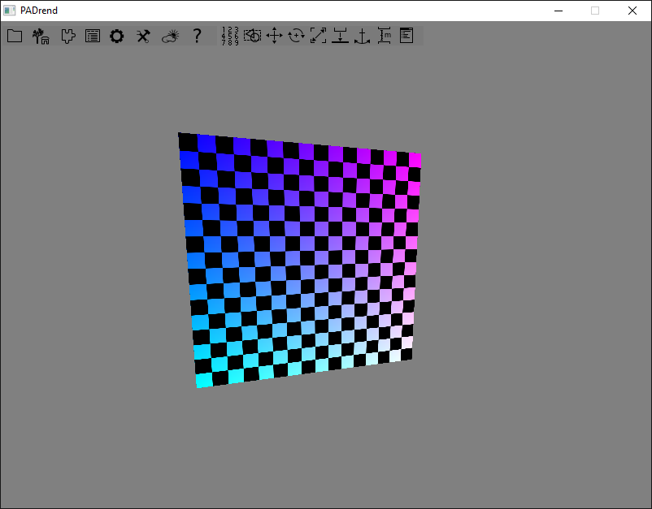

<!------------------------------------------------------------------------------------------------
This work is licensed under the Creative Commons Attribution-ShareAlike 4.0 International License.
 To view a copy of this license, visit http://creativecommons.org/licenses/by-sa/4.0/.
 Author: Henrik Heine (hheine@mail.uni-paderborn.de), Stanislaw Eppinger (eppinger@mail.uni-paderborn.de)
 PADrend Version 1.0.0
------------------------------------------------------------------------------------------------->
<!---BEGINN_INDEXSECTION--->
<!---Automaticly generated section. Do not edit!!!--->
# Overview
* 3.5.3 Node States
    * 3.5.3.1 [Introduction to States](../../../../3_Development_Guide/5_MinSG:_Minimalist_Scene_Graph/3_Node_States/1_Introduction_to_States.md)
    * 3.5.3.1 [Changing  n objects appearance using node states](../../../../3_Development_Guide/5_MinSG:_Minimalist_Scene_Graph/3_Node_States/1_Changing _n_objects_appearance_using_node_states/Changing _n_objects_appearance_using_node_states.md)
    * 3.5.3.2 [Node States for handling Blending and Transparency](../../../../3_Development_Guide/5_MinSG:_Minimalist_Scene_Graph/3_Node_States/2_Node_States_for_handling_Blending_and_Transparency.md/Node_States_for_handling_Blending_and_Transparency.md)
    * 3.5.3.3 [LightingState](../../../../3_Development_Guide/5_MinSG:_Minimalist_Scene_Graph/3_Node_States/3_Lighting_State/LightingState.md)
    * 3.5.3.4 [Using Scripts to alter the Rendering of Nodes](../../../../3_Development_Guide/5_MinSG:_Minimalist_Scene_Graph/3_Node_States/4_Using_Scripts_to_alter_the_Rendering_of_Nodes/Using_Scripts_to_alter_the_Rendering_of_Nodes.md)
    * 3.5.3.5 **Shaders in Node States**
    * 3.5.3.6 [GroupState](../../../../3_Development_Guide/5_MinSG:_Minimalist_Scene_Graph/3_Node_States/6_Group_State/GroupState.md)
<!---END_INDEXSECTION--->

# Shaders in Node States
This tutorial explains how to use shaders in states as well as how to set unifrom variables of shaders. 

## ShaderState
Of course PADrend allows you to add custom shaders to nodes. This is done my using the so called `ShaderState`. This state contains a shader program, which is automatically used when the corresponding node is rendered. Furthermore it is possible to add uniform variables to the state. Before rendering those uniforms are send to the GPU.

The usage of the `ShaderState` can be explained best by simply describing a simple example.

### Simple Example
This example will basically render a simple quad with a chess texture. But this time the color value of each fragment is not only based on the texture, but also on the value of the uv coordinate.
The final result will look like this:

Before we start with the shader, we first have to create a simple mesh. In this case we just build a simple quad. Afterwards we create a corresponding `GeometryNode` and add the chess texture to it.

<!---INCLUDE src=ShaderStateExample.escript, start=14, end=56--->
<!---BEGINN_CODESECTION--->
<!---Automaticly generated section. Do not edit!!!--->
    
    static Vec2 = Geometry.Vec2;
    static Vec3 = Geometry.Vec3;
    
    var buildMesh = fn() {
        // First we build a simple Mesh, consisting of a single quad
        var mb = new Rendering.MeshBuilder();
        mb.color(new Util.Color4f(1,0,1,0.5));
        // Vertex 0:
        mb.position(new Vec3(0,0,0));
        mb.texCoord0(new Vec2(0,1));
        mb.addVertex();
    
        // Vertex 1:
        mb.position(new Vec3(10,0,0));
        mb.texCoord0(new Vec2(1,1));
        mb.addVertex();
    
        // Vertex 2:
        mb.position(new Vec3(10,10,0));
        mb.texCoord0(new Vec2(1,0));
        mb.addVertex();
    
        // Vertex 3:
        mb.position(new Vec3(0,10,0));
        mb.texCoord0(new Vec2(0,0));
        mb.addVertex();
    
        // create quad
        mb.addQuad(0,1,2,3);
        // return mesh
        return mb.buildMesh();
    };
    
    // build GeometryNode with corresponding mesh
    var geo = new MinSG.GeometryNode(buildMesh());
    // create chess texture of size 1024*1024, with tiles of side length 64
    var chess = Rendering.createChessTexture(1024, 1024, 64);
    // create new TextureState
    var texState = new MinSG.TextureState(chess);
    // you could also set the TextureUnit:
    texState.setTextureUnit(0); // only needed if you add more than one texture though...
    // add state to node
<!---END_CODESECTION--->

If you have read the Texturing tutorial, this code is straight forward.
Next we continue with the actual shader code.

#### Shader code

<!---INCLUDE src=ShaderStateExample.escript, start=58, end=75--->
<!---BEGINN_CODESECTION--->
<!---Automaticly generated section. Do not edit!!!--->
    
    var vertexShaderCode = "
    void main(void) {
        gl_TexCoord[0] = gl_MultiTexCoord0;
        gl_Position = ftransform();
    }
    ";
    var fragmentShaderCode = "
    uniform sampler2D chessTexture;
    
    void main(void) {
        vec2 uv = gl_TexCoord[0].st;
        vec4 result = texture2D(chessTexture, uv);
        result.r *= uv.s;
        result.g *= uv.t;
        gl_FragColor = result;
    }
    ";
<!---END_CODESECTION--->

Our vertex shader is super simple, it does nothing more than just setting the texture coordinate and the position. This is done by using OpenGL internal functions. The fragment shader has a bit more functionality. It first retrieves the uv coordinate from the `gl_TexCoord` array. Afterwards we just look up the color of the chess texture at the given uv coordinate. To make it look different from the default shader, we further multiply the `r` and `g` channels of the color with the uv coordinate. This will result in a blue/purple coloring of the white tiles. The last step is just setting the `gl_FragColor` value.

#### ShaderState
Now we use this shader programm to instantiate a new `ShaderState`. Furthermore we also set a uniform variable. In this case we only have a single uniform value, which is the `chessTexture` variable. It is a `sampler2D` and therefore we have to set the correct texture unit for it.

<!---INCLUDE src=ShaderStateExample.escript, start=76, end=78--->
<!---BEGINN_CODESECTION--->
<!---Automaticly generated section. Do not edit!!!--->
    var shader = Rendering.Shader.createShader(vertexShaderCode, fragmentShaderCode);
    var shaderState = new MinSG.ShaderState(shader);
    // our chess texture is bound to texture unit 0
<!---END_CODESECTION--->

The `TextureState` was set to texture unit 0, therefore we also use the same unit here. After that, we can finally add this state to the node:

<!---INCLUDE src=ShaderStateExample.escript, start=79, end=79--->
<!---BEGINN_CODESECTION--->
<!---Automaticly generated section. Do not edit!!!--->
    shaderState.setUniform("chessTexture", Rendering.Uniform.INT, [0]);
<!---END_CODESECTION--->

Now the node will be rendered using the given shader.

## ShaderUniformState
In PADrend it is possible to set the uniform variables directly via the shader state or through the *ShaderUniformState*. The question might arise: Why having a second state to set uniform variables when you can set them directly in the shader state? One answer could be: When the *ShaderUniformState* is placed after the shader state you can overwrite existing uniform values. 

Let's take a look at an example which does exactly that. 

### Simple Example
This example is similar to the example in the *ShaderState* tutorial. We create a sphere, a chess texture and a shader which will map the chess texture on the sphere. Additionally we expand the fragment shader with a boolean value *showTexture* which determines whether the texture should be shown or not.

<!---INCLUDE src=ShaderUniformState.escript, start=32, end=41--->
<!---BEGINN_CODESECTION--->
<!---Automaticly generated section. Do not edit!!!--->
    var fragmentShaderCode = "
    uniform sampler2D chessTexture;
    uniform bool showTexture;
    
    void main(void) {
        vec2 uv = gl_TexCoord[0].st;
        vec4 result = vec4(1, 0.5, 0.5, 1);
        if (showTexture) result = texture2D(chessTexture, uv);
        gl_FragColor = result;
    }
<!---END_CODESECTION--->

Then we set the uniform values in our shader directly. Our shader will show the texture by default, that's why we set the *showTexture* uniform to true.

<!---INCLUDE src=ShaderUniformState.escript, start=47, end=50--->
<!---BEGINN_CODESECTION--->
<!---Automaticly generated section. Do not edit!!!--->
    // Our chess texture is bound to texture unit 0
    shaderState.setUniform("chessTexture", Rendering.Uniform.INT, [0]);
    // Set the showTexture uniform to true in the shader
    shaderState.setUniform("showTexture", Rendering.Uniform.BOOL, [true]);
<!---END_CODESECTION--->

Afterwards we create our ShaderUniformState and set the *showTexture* uniform to false.

<!---INCLUDE src=ShaderUniformState.escript, start=53, end=54--->
<!---BEGINN_CODESECTION--->
<!---Automaticly generated section. Do not edit!!!--->
    var uniformState = new MinSG.ShaderUniformState();
    uniformState.setUniform("showTexture", Rendering.Uniform.BOOL, [false]);
<!---END_CODESECTION--->

To see our ShaderUniformState taking effect we need to add it to the geometry node after our shader state.

<!---INCLUDE src=ShaderUniformState.escript, start=58, end=59--->
<!---BEGINN_CODESECTION--->
<!---Automaticly generated section. Do not edit!!!--->
    geo += shaderState;
    geo += uniformState;
<!---END_CODESECTION--->

The result will look like this:

The sphere will be untextured because our ShaderUniformState sets the *showTexture* uniform to false. When we disable the state or move it before the shader state the sphere will get a chess texture:

