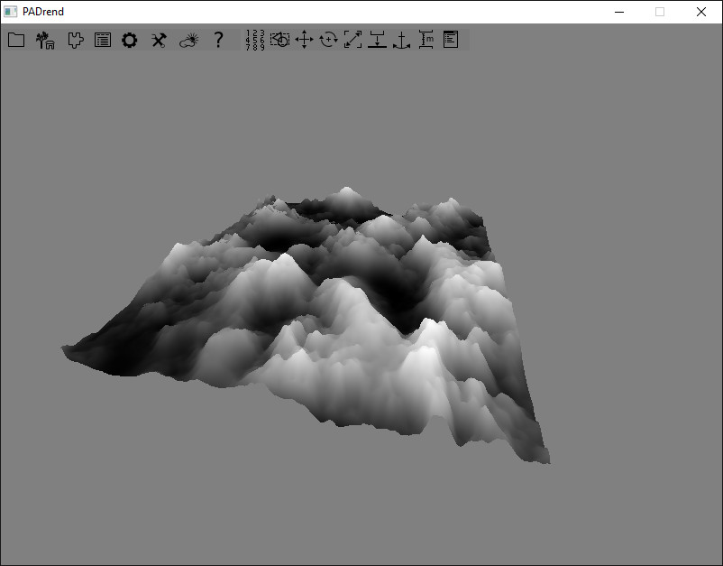

<!------------------------------------------------------------------------------------------------
This work is licensed under the Creative Commons Attribution-ShareAlike 4.0 International License.
 To view a copy of this license, visit http://creativecommons.org/licenses/by-sa/4.0/.
 Author: Henrik Heine (hheine@mail.uni-paderborn.de)
 PADrend Version 1.0.0
------------------------------------------------------------------------------------------------->
<!---BEGINN_INDEXSECTION--->
<!---Automaticly generated section. Do not edit!!!--->
# Overview
* 3.6 Rendring
    * 3.6.1 [Working with Meshes](../../../3_Development_Guide/6_Rendring/1_Working_with_Meshes/Working_with_Meshes.md)
    * 3.6.2 [Changing the Render Target: Rendering to a Texture](../../../3_Development_Guide/6_Rendring/2_Changing_the_Render_Target:_Rendering_to_a_Texture/Changing_the_Render_Target:_Rendering_to_a_Texture.md)
    * 3.6.3 [Coneverting Textures using Shaders: Texture Processor](../../../3_Development_Guide/6_Rendring/3_Coneverting Textures_using_Shaders:_Texture_Processor/Coneverting Textures_using_Shaders:_Texture_Processor.md)
    * 3.6.4 **Generating Terrains using a Heightmap Shader**
    * 3.6.5 [Post Process Effects in Example of Edge Enhencement](../../../3_Development_Guide/6_Rendring/5_Post_Process_Effects_in_Example_of_Edge_Enhencement/Post_Process_Effects_in_Example_of_Edge_Enhencement.md)
<!---END_INDEXSECTION--->

# Shader example: Heightmap
This simple example will render a terrain based on a heightmap. Instead of building a mesh based on the heightmap, the mesh itself is just a regular grid and the heightmap is applied in the vertex shader.
The full example can be found in [Heightmap.escript](Heightmap.escript).

First of all, we define a simple function, which will create a regular grid:

<!---INCLUDE src=HeightmapShader.escript, start=18, end=34--->
<!---BEGINN_CODESECTION--->
<!---Automaticly generated section. Do not edit!!!--->
    // creates a regular grid of the size width*height. Each single grid cell has a size of tileSize*tileSize
    var makeGrid = fn(Number width, Number height, Number tileSize = 1) {
        var xTiles = width / tileSize; // number of tiles in x direction
        var mb = new Rendering.MeshBuilder();
        mb.color(new Util.Color4f(1, 1, 1, 1));
        for(var y=0; y<height; y+=tileSize) {
            for(var x=0; x<width; x+=tileSize) {
                mb.position(new Vec3(x * tileSize, 0, y * tileSize));
                mb.texCoord0(new Vec2(x / width, y / height));
                var id = mb.addVertex();
                if(x > 0 && y > 0) {
                    mb.addQuad(id, id - xTiles, id - xTiles - 1, id - 1);
                }
            }
        }
        return mb.buildMesh();
    };
<!---END_CODESECTION--->

For each vertex we basically only need the position and the texture coordinate. The y-component of each vertex will be modified inside of the vertex shader. The texture coordinate is used to access the correct pixel of the heightmap.

The vertex shader looks like this:

<!---INCLUDE src=HeightmapShader.escript, start=47, end=62--->
<!---BEGINN_CODESECTION--->
<!---Automaticly generated section. Do not edit!!!--->
    uniform sampler2D heightmap;
    uniform float scale = 1.0;
    uniform float offset = 0.0;
    
    varying float normalizedHeight;
    varying float height;
    
    void main(void) {
        normalizedHeight = texture2D(heightmap, gl_MultiTexCoord0.st).r;
        height = offset + scale * normalizedHeight;
        gl_TexCoord[0] = gl_MultiTexCoord0;
        vec4 pos = ftransform();
        pos.y += height;
        gl_Position = pos;
    }
    ";
<!---END_CODESECTION--->

First of all we look up the corresponding pixel from the texture and use the value as a height. We use two uniforms in order to scale and offset this height value.

The fragment shader is a bit shorter:

<!---INCLUDE src=HeightmapShader.escript, start=64, end=70--->
<!---BEGINN_CODESECTION--->
<!---Automaticly generated section. Do not edit!!!--->
    varying float normalizedHeight;
    varying float height;
    
    void main(void) {
        gl_FragColor = vec4(normalizedHeight, normalizedHeight, normalizedHeight, 1);
    }
    ";
<!---END_CODESECTION--->

Here we just set the color based on the height of each fragment.

The final result looks like this:

