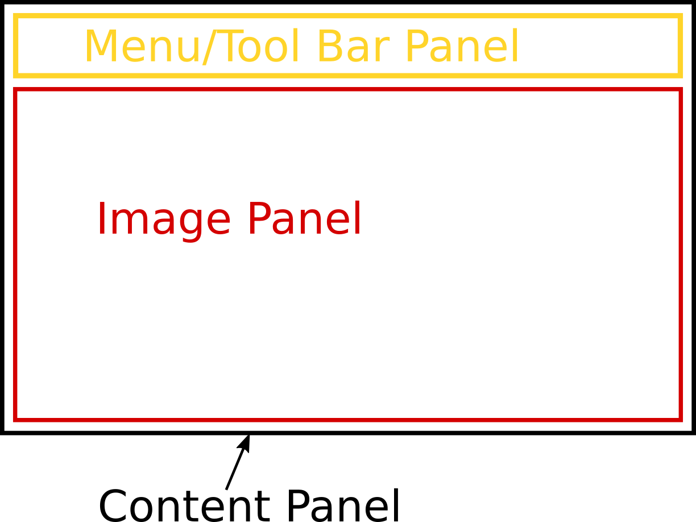

<!------------------------------------------------------------------------------------------------
This work is licensed under the Creative Commons Attribution-ShareAlike 4.0 International License.
 To view a copy of this license, visit http://creativecommons.org/licenses/by-sa/4.0/.
 Author: Florian Pieper (fpieper@mail.uni-paderborn.de)
 PADrend Version 1.0.0
------------------------------------------------------------------------------------------------->


# Building an image viewer. Part 1: The GUI
In this tutorial and the following tutorials we will build a small image viewer.
It will be capable of showing images and browsing through a folder of images.
Also there will be a very basic drawing function.

## In this tutorial
In this tutorial we will build the user interface of the image viewer.

## Creating a window
Window creation in PADrend is simple.
All we have to do is to call the function _createWindow_.
It takes three parameters.
The first two are the width and height of the window, the third one sets the window's title.
We use the member function _setPosition_ to position the window within PADrend.

<!---INCLUDE src=ImageViewer1.escript, start=24, end=26--->
<!---BEGINN_CODESECTION--->
<!---Automaticly generated section. Do not edit!!!--->
```js
var window = gui.createWindow(800, 800, "Image Viewer Tutorial Version 1");
window.setPosition(50, 50);

```
<!---END_CODESECTION--->

To open the window we have to call the member function _setEnabled_.

<!---INCLUDE src=ImageViewer1.escript, start=20, end=20--->
<!---BEGINN_CODESECTION--->
<!---Automaticly generated section. Do not edit!!!--->
```js
this.window.setEnabled(true);
```
<!---END_CODESECTION--->

That is all we need to do to open an empty window.

## Creating the window's content
In PADrend panels are used as containers to group GUI elements.
The first thing we need to do is to create the basic layout by panels.
We will start with three of them.
One will hold the image, one is needed to hold the menu- and tool-bar.
The third panel will serve as content panel and contains the other two panels.
See the image below for the layout.



There are two techniques to create a GUI element in PADrend.
We used the first way to create our window.
Therefore we called the _createWindow_ function.
There exist several functions to create other GUI elements.
After we have created the element, we use its member functions to specialize it.
The other way is a descriptional one.
The GUI element is described by an map, containing all necessary information.
The specialization of the element is also included in the map.
We will use both ways in the creation of our panels.
First of all we create the content panel by using the first technique.

<!---INCLUDE src=ImageViewer1.escript, start=27, end=33--->
<!---BEGINN_CODESECTION--->
<!---Automaticly generated section. Do not edit!!!--->
```js
var contentPanel = gui.createPanel(800, 700);
contentPanel.setExtLayout(
        GUI.POS_X_ABS|GUI.REFERENCE_X_LEFT|GUI.ALIGN_X_LEFT|
        GUI.POS_Y_ABS|GUI.REFERENCE_Y_TOP|GUI.ALIGN_Y_TOP|
        GUI.WIDTH_ABS|GUI.HEIGHT_ABS,
        new Geometry.Vec2(0,0),new Geometry.Vec2(-1, -1) 
);
```
<!---END_CODESECTION--->

The function _createPanel_ creates a panel having a width and a height.
We can also add flags (such as _GUI.BORDER_ for a panel with an outline) as additional argument.
In the next step we add layout information to the panel.
The layout information will be explained in detail in the next section.
The panels for the image and the controls will be created by the second technique.
Note that you can also use the _+=_ operator on a panel to add content to it.
In this way you can also pass a description as a list of maps to it.
Each map in the list describes one GUI element.
In this way we add the panel for the controls to the content panel.

<!---INCLUDE src=ImageViewer1.escript, start=35, end=42--->
<!---BEGINN_CODESECTION--->
<!---Automaticly generated section. Do not edit!!!--->
```js
contentPanel += [{
    GUI.TYPE : GUI.TYPE_PANEL,
    GUI.FLAGS : GUI.BORDER,	
    GUI.POSITION : [GUI.POS_X_ABS|GUI.REFERENCE_X_LEFT|GUI.ALIGN_X_LEFT|
                    GUI.POS_Y_ABS|GUI.REFERENCE_Y_TOP|GUI.ALIGN_Y_TOP ,0,0],
    GUI.SIZE : [GUI.WIDTH_ABS|GUI.HEIGHT_ABS, -20, 75],
    GUI.CONTENTS : [this.createMenu(), this.createToolBar()]    
}];
```
<!---END_CODESECTION--->

The map contains of predefined keys and values that describes the UI element.
Since we need a panel we set _GUI.TYPE_PANEL_ as value for _GUI.TYPE_.
We use _GUI.BORDER_ as flag, so that we see the border of the panel.
The keys _GUI.POSITION_ and _GUI.SIZE_ are used for the layouting of the panel.
At last we use _GUI.CONTENTS_ to add the controls to the panel.
The controls are created by two functions and will be explained in detail later.
The method above creates an anonymous panel.
Since we will not alter the panel there is no need to store it somewhere, so that leave it anonymous is fine.
However we need to change the image shown in the image panel, so that it can not be anonymous.
One way of creating it would be the function _createPanel_, but we can also _create_ which creates a GUI element by a description.
The description is similar to the one for the controls panel.
We store the panel in an attribute so that we can access it later on.

<!---INCLUDE src=ImageViewer1.escript, start=44, end=52--->
<!---BEGINN_CODESECTION--->
<!---Automaticly generated section. Do not edit!!!--->
```js
this.imagePanel = gui.create({
    GUI.TYPE : GUI.TYPE_PANEL,
    GUI.FLAGS : GUI.BORDER,	
    GUI.WIDTH : 750,
    GUI.HEIGHT : 400,
    GUI.POSITION : [GUI.POS_X_ABS|GUI.REFERENCE_X_LEFT|GUI.ALIGN_X_LEFT|
                    GUI.POS_Y_ABS|GUI.REFERENCE_Y_TOP|GUI.ALIGN_Y_TOP ,0,0],
    GUI.SIZE : [GUI.WIDTH_ABS|GUI.HEIGHT_ABS, -20, -100]   
});
```
<!---END_CODESECTION--->

In a last step we need to add the image panel to the content panel and the content panel to the window.
As explained before the _+=_ operator can be used to add content to a panel.
In addition you can also use the member function _add_.
First of all we add _GUI.TYPE_NEXT_ROW_ to the content panel to ensure the image panel is positioned under the control panel.
Afterwards we add the image panel to the content panel by using _add_.
In a last step we use _+=_ to add the content panel to the window.

<!---INCLUDE src=ImageViewer1.escript, start=54, end=56--->
<!---BEGINN_CODESECTION--->
<!---Automaticly generated section. Do not edit!!!--->
```js
contentPanel += [{GUI.TYPE : GUI.TYPE_NEXT_ROW}];
contentPanel.add(this.imagePanel);
window += contentPanel;
```
<!---END_CODESECTION--->

### Layout information

Components reference point. Tells PADrend where the coordinates origin within the component is.
* _REFERENCE_X_LEFT_ : x-coordinate of origin is on the left side.
* _REFERENCE_X_CENTER_ : x-coordinate of origin is in the center.
* _REFERENCE_X_RIGHT_ : x-coordinate of origin is on the right side.
* _REFERENCE_Y_TOP_ : y-coordinate of origin is on the top.
* _REFERENCE_Y_CENTER_ : y-coordinate of origin is in the center.
* _REFERENCE_Y_BOTTOM_ : y-coordinate of origin is on the bottom.

Alignment inside parent. Tells PADrend where to position the component within its parents component.
* _ALIGN_X_RIGHT_ : Use parents right side as reference for the components alignment in x direction.
* _ALIGN_X_CENTER_ : Use parents center as reference for the components alignment in x direction.
* _ALIGN_X_LEFT_ : Use parents left side as reference for the components alignment in x direction.
* _ALIGN_Y_TOP_ : Use parents right side as reference for the components alignment in y direction.
* _ALIGN_Y_CENTER_ : Use parents center as reference for the components alignment in y direction.
* _ALIGN_Y_BOTTOM_ : Use parents left side as reference for the components alignment in y direction.

Type of position value. Sets the components position within the parents components. If not set the components values will be used. Absolute means the position is passed in pixels. Relative means the position is passed as percentage value between 0 and 1. You can also mix relative and absolute values. The values is passed as _Geometry.Vec2_.
* _POS_X_ABS_ : Positions x-coordinate in pixels.
* _POS_X_REL_ : Positions x-coordinate as percentage value.
* _POS_Y_ABS_ : Positions y-coordinate in pixels.
* _POS_Y_REL_ : Positions y-coordinate as percentage value.

Type of size value. Sets the components size. As for the position the value can be passed as absolute or relative. A _Geometry.Vec2_ is used as input. If one axis is not is not set, the components value will be used.

* _WIDTH_REL_ : Set the width relative to the parents width.
* _HEIGHT_REL_ : Set the height relative to the parents height.
* _WIDTH_ABS_ : Set the width in pixels. On negative values, the value is subtracted form the parents width.
* _HEIGHT_ABS_ : Set the height in pixels. On negative values, the value is subtracted form the parents height.
* _WIDTH_CHILDREN_REL_ : Set the width relative to the children’s width.
* _HEIGHT_CHILDREN_REL_ : Set the height relative to the children’s height.
* _WIDTH_CHILDREN_ABS_ : Set the width in pixels. On negative values, the value is subtracted form the children’s width.
* _HEIGHT_CHILDREN_ABS_ : Set the height in pixels. On negative values, the value is subtracted form the children’s height.
* _WIDTH_FILL_REL_ : Fills up the components width relative to the parents width.
* _HEIGHT_FILL_REL_ : Fills up the components height relative to the parents height.
* _WIDTH_FILL_ABS_ : Fills up the components width absolute to the parents width.
* _HEIGHT_FILL_ABS_ : Fills up the components height absolute to the parents height.

Lets have a look at a small example:

    component->setExtLayout(
        POS_X_ABS|REFERENCE_X_CENTER|ALIGN_X_CENTER|
        POS_Y_ABS|REFERENCE_Y_CENTER|ALIGN_Y_CENTER|
        WIDTH_ABS|HEIGHT_REL,
        Vec2(0.0,0.0), Vec(-20,0.5) );

The reference point is set to the center.
The component is aligned to the center.
The position is given in absolute coordinates and it is set to _(0,0)_.
So the component is centered in the parents component.
The width is given in absolute coordinates and the height is given relative to the parents height.
For width and height _(-20, 0.5)_ is set.
So that the components width is 20 pixels less than the parents width and the components height is 50% of the parents height.

### Creating the menu
Lets write a function to create our menu.
The first thing we need is a container holding our menus.
We use a panel for this purpose.
The panel's layout is set to _GUI.AUTO_LAYOUT_.

<!---INCLUDE src=ImageViewer1.escript, start=62, end=62--->
<!---BEGINN_CODESECTION--->
<!---Automaticly generated section. Do not edit!!!--->
```js
var menu = gui.createPanel(100, 50, GUI.AUTO_LAYOUT);
```
<!---END_CODESECTION--->

For our image viewer we will need to menus.
The first one is the file menu, which handles opening and saving of image files.
The second menu is a config menu.
It has a single menu entry, which changes the color of the drawing function.
We use the descriptive technique to create the menus.
The entry _GUI.TYPE_ is set to _GUI.TYPE_MENU_, to indicate that we describe a menu.
Both of our menus get an icon.
If you have ever seen the user interface of PADrend, you know that it contains some icons.
We can make use of this icons, as they are registered to PADrend.
Each icon can be addressed via a string value.
You can find the icons in the folder _plugins/PADrend/resources/Icons_ (relative to PADrends main folder).
The included JSON file defines the string values of the icons.
To set the icon of a menu the key _GUI.ICON_ is used.
For the file menu we use the value _#File_ and for the settings menu _#Settings_.
The menu items are created from a list of labels.
We attach a function to each menu entry using _GUI.ON_CLICK_.
This function is called when the user clicks on the menu entry.
Since in this tutorial we only build the user interface, we leave most of the functions empty for now.
If one of the functions is called, the context of the _this_ pointer changes to the calling object.
Since the calling object is some event handling object of PADrend, we can not access the fields of our class by using the _this_ pointer.
But since we need to alter its state (for example when loading an image), we have to pass the _this_ object to the function.
As you may know we can use Escript's _=>_ operator for this purpose.
This is done for each of the functions.  
However we implement the function of the last menu entry, which is used to close the window.
To close the window we only have to call the member function _close()_ on the window object.
You can see how the passed object context is used to access the window object.  
You may have noticed that inbetween the menu item there are some lines containing _'----'_.
This lines build separates between the menu entries and help to structure the menu.  
The settings menu is created in a similar way like the file menu.

<!---INCLUDE src=ImageViewer1.escript, start=64, end=126--->
<!---BEGINN_CODESECTION--->
<!---Automaticly generated section. Do not edit!!!--->
```js
menu += [
    {
        GUI.TYPE				:	GUI.TYPE_MENU,
        GUI.TOOLTIP				:	"File",
        GUI.ICON				:	"#File",
        GUI.MENU				:	[
            {
                GUI.LABEL : "Open Folder...",
                GUI.ON_CLICK : [this] => fn(imageViewer){
                    ;
                }
            },
            
            {
                GUI.LABEL : "Open Image File...",
                GUI.ON_CLICK : [this] => fn(imageViewer){
                    ;
                }
            },
            
            '----',
            
            {
                GUI.LABEL : "Save File as...",
                GUI.ON_CLICK : [this] => fn(imageViewer){
                    ;
                }
            },
            
            {
                GUI.LABEL : "Save File...",
                GUI.ON_CLICK : [this] => fn(imageViewer){
                    
                }
            },
            
            '----',
            
            {
                GUI.LABEL : "Close",
                GUI.ON_CLICK : [this] => fn(imageViewer){					
                    imageViewer.window.close();
                }
            }
        ],	
    },
    
    {
        GUI.TYPE				:	GUI.TYPE_MENU,
        GUI.TOOLTIP				:	"Settings",
        GUI.ICON				:	"#Settings",
        GUI.MENU_WIDTH			: 	150,
        GUI.MENU				:	[
            {
                GUI.LABEL : "Choose Color...",
                GUI.ON_CLICK : [this] => fn(imageViewer){
                    ;
                }
            }
        
        ],
    },
];
```
<!---END_CODESECTION--->

### Creating the tool-bar
The tool-bar is used to switch between the two tools, which will be created for the image viewer.
Each button in the tool-bar gets an icon.
You can find the icons in the _resources_ folder of the tutorial.
If you want to create an icon set by your own, you can user the function _gui.loadIconFile_ to load them.
The function loads a JSON file, which describes the icon set.
The JSON file can include one or multiple image files.
For each icon, its position within the image file, its size and an identifier is stored.
Here you can see an example of such a JSON file:

    [{
        "image" : "SomeImage.png",
        "icons" : {
            "#Icon1" : [0, 0, 16, 16],
            "#Icon2" : [16, 0, 16, 16]  
        },
    },
    {
        "image" : "AnotherImage.png",
        "icons" : {
            "#Icon3" : [0, 0, 32, 32]  
        }  
    }]

The structure is straight forward.
The lines containing "image" defining the input image files.
After such a line the description of the icons within the image follows.
In this way it is possible to create images that contain a number of icons.
For each icon the offset within the image and the size of the icon is defined in the form [x-offset, y-offset, width, height].  
_gui.loadIconFile_ loads all icons defined in the file and registers them to PADrend, so that you can address them by their identifier.

<!---INCLUDE src=ImageViewer1.escript, start=133, end=133--->
<!---BEGINN_CODESECTION--->
<!---Automaticly generated section. Do not edit!!!--->
```js
gui.loadIconFile(__DIR__ + "/resources/icons.json");
```
<!---END_CODESECTION--->

We need four buttons for switching between images of a folder and between the tools.
The creation of buttons is similar to the creation of the menus.
Again there is a _ON_CLICK_ function, which is called whenever the button is clicked.
For the image switching buttons we leave it empty for now.  

<!---INCLUDE src=ImageViewer1.escript, start=135, end=155--->
<!---BEGINN_CODESECTION--->
<!---Automaticly generated section. Do not edit!!!--->
```js
var toolBar = gui.createPanel(450, 55, GUI.AUTO_LAYOUT);

toolBar += [
    {
        GUI.TYPE : GUI.TYPE_BUTTON,
        GUI.ICON : "#Tut_Left",
        GUI.TOOLTIP : "Previouse Image",
        GUI.ON_CLICK : [this] => fn(imageViewer){
            ;
        }
    },
    {
        GUI.TYPE : GUI.TYPE_BUTTON,
        GUI.ICON : "#Tut_Right",
        GUI.TOOLTIP : "Next Image",
        GUI.ON_CLICK : [this] => fn(imageViewer){
            ;
        }
        
    }	
];
```
<!---END_CODESECTION--->

To indicate which tool is selected we will set the corresponding button to stay pressed.
So we will need to access the buttons within their _ON_CLICK_ function.
That is why the buttons are stored in static variables.
Within the _ON_CLICK_ function we set the one button pressed by calling _isSwitch_.
The rest of the function will be created in a later tutorial.

<!---INCLUDE src=ImageViewer1.escript, start=157, end=181--->
<!---BEGINN_CODESECTION--->
<!---Automaticly generated section. Do not edit!!!--->
```js
static btnDrawTool;
static btnMoveTool;

btnDrawTool = gui.create({
    GUI.TYPE : GUI.TYPE_BUTTON,
    GUI.ICON : "#Tut_Pen",
    GUI.TOOLTIP : "Draw Tool",
    GUI.ON_CLICK : [this] => fn(imageViewer){
        btnDrawTool.setSwitch(true);
        btnMoveTool.setSwitch(false);
    }
});

btnMoveTool = gui.create({
    GUI.TYPE : GUI.TYPE_BUTTON,
    GUI.ICON : "#Tut_Move",
    GUI.TOOLTIP : "Move Tool",
    GUI.ON_CLICK : [this] => fn(imageViewer){
        btnDrawTool.setSwitch(false);
        btnMoveTool.setSwitch(true);
    }
});

toolBar += btnDrawTool;
toolBar += btnMoveTool;
```
<!---END_CODESECTION--->


