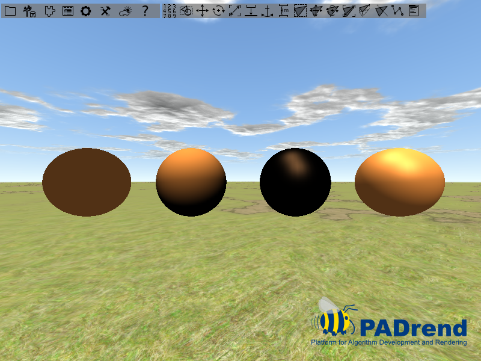
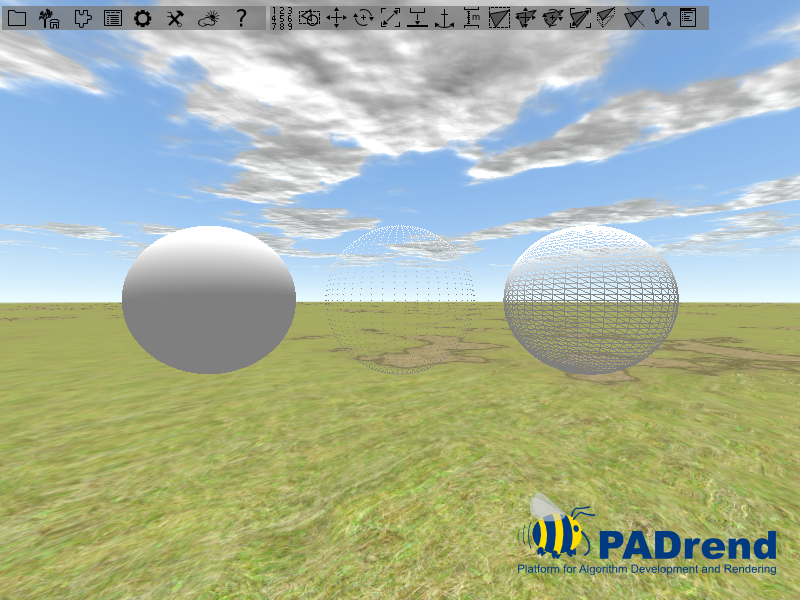
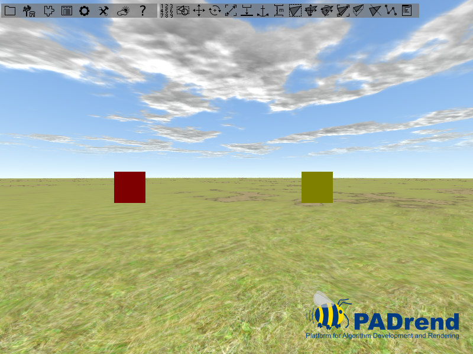
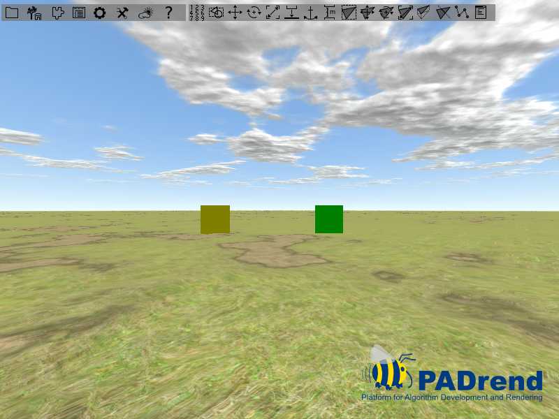

<!------------------------------------------------------------------------------------------------
This work is licensed under the Creative Commons Attribution-ShareAlike 4.0 International License.
 To view a copy of this license, visit http://creativecommons.org/licenses/by-sa/4.0/.
 Author: Florian Pieper (fpieper@mail.uni-paderborn.de), Henrik Heine (hheine@mail.uni-paderborn.de)
 PADrend Version 1.0.0
------------------------------------------------------------------------------------------------->

In the following you find some node state that change the appearance of their associated geometry nodes in some way.

## Material State
This section shows the usage of materials and their interaction with the Phong illumination model.

### Requierments
You should have understand the tutorial about lighting states.

### Material
As mentioned in the lighting state tutorial, the lights color is divided into three parts, which are ambient, diffuse and specular.
Materials can also be seen to be some kind of color, that is used to color objects.
A lighting model is used to calculate the final color of an object.
In PADrend, by default the phong model is used.
It combines the lights color, the lights position, the viewers position as well as the material to calculate a color value for each surface point of an object.
The Phong equation calculates a color value for each of the three parts and combines them to a single color value.
Therefore also the material contains of three color value (ambient, diffuse, specular).
In addition a shininess value describes whether the material is rough or mirror like.
It takes part in the calculation of the specular part.   
For this tutorial we will create four spheres.
The first three show the single parts of the Phong model individually.
Therefore the material parts that should not be considered by the equation are set to black color.
As mentioned, the Phong equation includes the light sources position.
To ensure the same configuration, each sphere has its own light source, which is positioned relative to it.
A light source and a sphere are connected by an lighting state.

#### Creating a sphere
Since the spheres only differ in their position and material, but overall the code for creating them is the same, we introduce a function for the creation.

<!---INCLUDE src=MaterialState.escript, start=14, end=50--->
<!---BEGINN_CODESECTION--->
<!---Automaticly generated section. Do not edit!!!--->
```js
//creates a geometry node with a material state and attaches a light source to it
var createNodeWithLightSource = fn(xMovement, Util.Color4f ambient, Util.Color4f diffuse, Util.Color4f specular, shininess){
    //creating a geometry node containing the mesh
    var mesh = Rendering.MeshBuilder.createSphere(50, 50);
    var geoNode = new MinSG.GeometryNode(mesh);
    geoNode.moveLocal(new Geometry.Vec3(xMovement, 0, 0));
    
    //create a material state and setting its properties
    var materialState = new MinSG.MaterialState();
    materialState.setAmbient(ambient);
    materialState.setDiffuse(diffuse);
    materialState.setSpecular(specular);
    materialState.setShininess(shininess);
    
    //creating a new light node having a white light color
   var pointLightNode = new MinSG.LightNode(MinSG.LightNode.POINT);
   pointLightNode.setAmbientLightColor(new Util.Color4f(1.0, 1.0, 1.0, 1.0));
   pointLightNode.setSpecularLightColor(new Util.Color4f(1.0, 1.0, 1.0, 1.0));
   pointLightNode.setDiffuseLightColor(new Util.Color4f(1.0, 1.0, 1.0, 1.0));
   pointLightNode.moveLocal(new Geometry.Vec3(xMovement, 5, 5));
   
   //creating a light state so that only the geometry node ist illuminated by the light source
   var lightingState = new MinSG.LightingState(pointLightNode);
   lightingState.setEnableLight(true);
   
   //adding the states to the node
   geoNode.addState(materialState);
   geoNode.addState(lightingState);
   
   //creating a subtree for the created nodes
   var lstNode = new MinSG.ListNode();
   lstNode += geoNode;
   lstNode += pointLightNode;
   
   //returning the subtree
   return lstNode;
};
```
<!---END_CODESECTION--->

First of all a geometry node containing the sphere is created and positioned.
Afterwards a material state is instantiated.
By default the state represents a light gray material.
For each of the three parts there is a setter and getter.
We use the getters to set the materials colors.
The values are passed as parameters to our function.
At last we set the shininess, which is a value between _0_ and _128_.  
Next up we create a light source.
It gains white colored light.
A light state is used to connect it to the geometry node holding the sphere.
Both states get attached to the node by calling _addState_.  
In a last step we create a _ListNode_ which combines both nodes in a common subtree.
This node is returned, so that it can be in the scene graph.

#### Creating the nodes
For this tutorial we use a bras like material.
You can find tables on the Internet that provide you with color values for a bunch of materials.
Keep in mind that you need to scale the shininess value to be in between _0_ and _128_.
The values may be provided in a range from _0_ to _1_.
In this case you simply need to multiply the value by _128_.
For the bras material we use:

<!---INCLUDE src=MaterialState.escript, start=52, end=56--->
<!---BEGINN_CODESECTION--->
<!---Automaticly generated section. Do not edit!!!--->
```js
//color of a brass like material
var ambientPart = new Util.Color4f(0.2125, 0.1275, 0.054, 1.0);
var diffusePart = new Util.Color4f(0.714, 0.4284, 0.18144, 1.0);
var specularPart = new Util.Color4f(0.393548, 0.271906, 0.166721, 1.0);
var shininess = 25.6;
```
<!---END_CODESECTION--->

In addition we need a black color to switch off single parts of the Phong equation.

<!---INCLUDE src=MaterialState.escript, start=58, end=59--->
<!---BEGINN_CODESECTION--->
<!---Automaticly generated section. Do not edit!!!--->
```js
//black color for switching single parts of the phong equation off 
var blackColor = new Util.Color4f(0.0, 0.0, 0.0, 1.0);
```
<!---END_CODESECTION--->

Next up we create the four nodes.
The first three nodes represent the three parts of the equation from left to right in the order ambient, diffuse and specular.
The node on the right side shows the illumination created by the Phong model.
In a last step all nodes are connected to build a scene graph.

<!---INCLUDE src=MaterialState.escript, start=61, end=74--->
<!---BEGINN_CODESECTION--->
<!---Automaticly generated section. Do not edit!!!--->
```js
//creating four nodes
//the first three nodes show the single parts of the phong equation individually 
var nodeAmbient = createNodeWithLightSource(-4.5, ambientPart, blackColor, blackColor, 0.0); 
var nodeDiffuse = createNodeWithLightSource(-1.5, blackColor, diffusePart, blackColor, 0.0); 
var nodeSpecular = createNodeWithLightSource(1.5, blackColor, blackColor, specularPart, 25.6); 
//the last node shows the resulting phong illumination
var nodePhong = createNodeWithLightSource(4.5, ambientPart, diffusePart, specularPart, 25.6);  

//creating the scene graph
var scene = new MinSG.ListNode();
scene += nodeAmbient;
scene += nodeDiffuse;
scene += nodeSpecular;
scene += nodePhong;
```
<!---END_CODESECTION--->

The image below shows the outcome.
You can easily see that the ambient part is constant over the whole sphere.
The diffuse term only depends on the light sources position, so that it is constant as long as the light source does not change.
The specular part depends on the viewers position, so that from different position you can observe changes in the specular reflection.



## PolygonModeState
With polygon modes you can change the way a mesh is rendered.
One way of applying polygon modes to a node is using a _MinSG.PolygonModeState_.
There are three modes that can be set in the state:
* FILL: the mesh is rendered with a solid surface.
* LINE: only the outlines of the meshes polygons are rendered.
* POINT: only the meshes vertices are rendered as dots.

### Creating the scene
The scene is build from three spheres, which are positioned on the x-y-plane beside each other.
Each sphere have a _PolygonModeState_ attached to it, so that you can observe the effect of the different modes.  
For each sphere a _GeometryNode_ is instantiated.
After that the nodes are moved so that they do not overlap.

<!---INCLUDE src=PolygonModeState.escript, start=14, end=24--->
<!---BEGINN_CODESECTION--->
<!---Automaticly generated section. Do not edit!!!--->
```js
//create a sphere mesh
var mesh = Rendering.MeshBuilder.createSphere(50, 50);

//create three geometry nodes including the mesh
var node1 = new MinSG.GeometryNode(mesh);
var node2 = new MinSG.GeometryNode(mesh);
var node3 = new MinSG.GeometryNode(mesh);

//move two nodes so that they are seperated
node1.moveLocal(new Geometry.Vec3(-2.5, 0, 0));
node3.moveLocal(new Geometry.Vec3(2.5, 0, 0));
```
<!---END_CODESECTION--->

Next up we create the three node states.
There are two ways to set the mode of a state.
First of all you can call _setMode_ on the state and pass a mode to it.

<!---INCLUDE src=PolygonModeState.escript, start=26, end=31--->
<!---BEGINN_CODESECTION--->
<!---Automaticly generated section. Do not edit!!!--->
```js
//create three polygone mode states with different modes
var fillState = new MinSG.PolygonModeState();
fillState.setMode(Rendering.PolygonModeParameters.FILL);

var pointState = new MinSG.PolygonModeState();
pointState.setMode(Rendering.PolygonModeParameters.POINT);
```
<!---END_CODESECTION--->

For the second way you need to instantiate a _Rendering.PolygonModeParameters_ object.
You can than use _setMode_ on the parameter to set the mode.
After that the parameter is added to the state by calling _setParameters_.

<!---INCLUDE src=PolygonModeState.escript, start=33, end=36--->
<!---BEGINN_CODESECTION--->
<!---Automaticly generated section. Do not edit!!!--->
```js
var lineState = new MinSG.PolygonModeState();
var parameter = new Rendering.PolygonModeParameters();
parameter.setMode(Rendering.PolygonModeParameters.LINE);
lineState.setParameters(parameter);
```
<!---END_CODESECTION--->

Next up we attach the states to our nodes.

<!---INCLUDE src=PolygonModeState.escript, start=38, end=41--->
<!---BEGINN_CODESECTION--->
<!---Automaticly generated section. Do not edit!!!--->
```js
//add the states to the nodes
node1.addState(fillState);
node2.addState(pointState);
node3.addState(lineState);
```
<!---END_CODESECTION--->

In a last step a scene graph is build and register to PADrend.
The different polygon modes can be seen in the image below.



## TextureState
The easiest way to add textures to a certain scene node is by adding a `TextureState` to it. As every state, it is added directly to a node. If the node is rendered, each state is enabled. In the case of `TextureState`s, this means that it will automatically upload the texture to the correct texture unit of the GPU. Therefore the shader can access the texture correctly. If you have not provided an own shader, the default shader will be used, which renders the mesh using color blending and texture mapping. Typically you will therefore set the color to white.

A `TextureState` is created and used the following way:
```
node += new MinSG.TextureState(texture);
```
where node is a `MinSG.Node`, like a `GeometryNode` or `ListNode`. The `texture` variable must hold a valid OpenGL texture, which could be obtain from file via: `Rendering.createTextureFromFile(file)`
> Remember that any node will inherit all states from their ancestors. Therefore if you add a `TextureState` to a `ListNode`, all child nodes will be textured.

The default shader can only texture the mesh correctly, if the vertices have a texture attribute.

### Example
In this simple example we construct a simple quad mesh and add a chess pattern to it:
<!---INCLUDE src=Texturing.escript, start=14, end=63--->
<!---BEGINN_CODESECTION--->
<!---Automaticly generated section. Do not edit!!!--->
```js
static Vec2 = Geometry.Vec2;
static Vec3 = Geometry.Vec3;

var buildMesh = fn() {
    // First we build a simple Mesh, consisting of a single quad
    var mb = new Rendering.MeshBuilder();
    mb.color(new Util.Color4f(1,1,1,1));
    // Vertex 0:
    mb.position(new Vec3(0,0,0));
    mb.texCoord0(new Vec2(0,1));
    mb.addVertex();

    // Vertex 1:
    mb.position(new Vec3(10,0,0));
    mb.texCoord0(new Vec2(1,1));
    mb.addVertex();

    // Vertex 2:
    mb.position(new Vec3(10,10,0));
    mb.texCoord0(new Vec2(1,0));
    mb.addVertex();

    // Vertex 3:
    mb.position(new Vec3(0,10,0));
    mb.texCoord0(new Vec2(0,0));
    mb.addVertex();

    // create quad
    mb.addQuad(0,1,2,3);
    // return mesh
    return mb.buildMesh();
};

// build GeometryNode with corresponding mesh
var geo = new MinSG.GeometryNode(buildMesh());
// create chess texture of size 1024*1024, with tiles of side length 64
var chess = Rendering.createChessTexture(1024, 1024, 64);
// create new TextureState
var texState = new MinSG.TextureState(chess);
// you could also set the TextureUnit:
texState.setTextureUnit(0); // only needed if you add more than one texture though...
// add state to node
geo += texState;


// create new scene and add node to it
var sceneNode = new MinSG.ListNode();
sceneNode += geo;
PADrend.registerScene(sceneNode);
PADrend.selectScene(sceneNode);
```
<!---END_CODESECTION--->
First of all we just declare two static variable in order to access the `Vec2` and `Vec3` classes without using the full name, like `Geometry.Vec3`. Afterwards we define a simple function, which is used to generate a simple mesh. This mesh consists of only four vertices:
```
(0,10,0) --- (10,10,0)
   |             |
   |             |
   |             |
(0,0,0)  --- (10,0,0)
```
Each vertex gets a 2D vector describing the texture coordinate of this vertex. Texture coordinates are given in texture space, therefore the origin (0,0) lies in the bottom left corner and NOT in the top left corner. Furthemore this space is normalized, therefore the top right corner of any texture, regardlessly of the size, has the coordinate (1,1).
If you specify a value that goes beyond the range (0,0) - (1,1), the behavior depends on the settings. By default it is set to `wrap` mode. This means that only the fractional part of a coordinate is used and therefore it 'wraps around'.

In this simple example we just create a chess texture by using a little helper function:
```
var chess = Rendering.createChessTexture(1024, 1024, 64);
```
The first two arguments specify the size of the texture and the last argument specifies the side length of a single chess tile. Afterwards we create a new texture state.

Now we could change the texture unit of this state, by using `setTextureUnit(unit)`. The default shader will only use texture unit 0, but if you provide an own shader, you could of course use all texture units.

## CullFaceState
This section shows an example usage of culling states.

### Back and front face culling
The time that is needed to render a frame depends on the number of polygons that must be rendered.
To reduce the time - in other words to achieve higher frame rates - polygons that are not visible to the viewer should not be rendered.
Finding all of this polygons is a computational expensive problem.
However, it is easy to find out which polygons of an object facing the viewer (front face) and which are turned away from him (back face).
Back facing polygons are not visible to the user, so that they do not need to be rendered.
To determine if a polygon is back facing, the angle between the viewing direction and the polygons normal is evaluated.
The angle is tested against a value to divide between front and back face.
This is done in the rendering pipeline.
Front face culling works analog.  
For some applications it is necessary to deactivate the back face culling.
A culling state can be used to change the culling mode of a node.

### Creating the scene
The scene contains of four squares.
Since squares are 2 dimensional objects they have a front and a back face.
Each one has a unique color to distinguish between them.
There is a function that creates a geometry node containing a square.
The color and the position of a square are passed by two parameters.

<!---INCLUDE src=CullFaceState.escript, start=37, end=41--->
<!---BEGINN_CODESECTION--->
<!---Automaticly generated section. Do not edit!!!--->
```js
//creating four squares, each having an unique color
var node1 = createNodeWithRect(new Util.Color4f(1, 0, 0, 1), -3.5);
var node2 = createNodeWithRect(new Util.Color4f(0, 1, 0, 1), -1.5);
var node3 = createNodeWithRect(new Util.Color4f(0, 0, 1, 1), 0.5);
var node4 = createNodeWithRect(new Util.Color4f(1, 1, 0, 1), 2.5);
```
<!---END_CODESECTION--->

Next up we create four culling states.
For the first three states the method _setCullMode_ is used to set the sates mode.
There are three cull modes which can be found in the namespace _Rendering_:
* _CULL_BACK_ : Enables back face culling only.
* _CULL_FRONT_ : Enables front face culling only.
* _CULL_FRONT_AND_BACK_ : Enables front and back face culling.

<!---INCLUDE src=CullFaceState.escript, start=43, end=52--->
<!---BEGINN_CODESECTION--->
<!---Automaticly generated section. Do not edit!!!--->
```js
//different culling states
//enable back face culling
var stateCullBack = new MinSG.CullFaceState();
stateCullBack.setCullMode(Rendering.CULL_BACK);
//enable front face culling
var stateCullFront = new MinSG.CullFaceState();
stateCullFront.setCullMode(Rendering.CULL_FRONT);
 //enable front and back face culling
var stateCullBoth = new MinSG.CullFaceState();
stateCullBoth.setCullMode(Rendering.CULL_FRONT_AND_BACK);
```
<!---END_CODESECTION--->

To deactivate culling we create a cull state and call the method _setCullingEnabled_.
We pass _false_ to it.

<!---INCLUDE src=CullFaceState.escript, start=53, end=55--->
<!---BEGINN_CODESECTION--->
<!---Automaticly generated section. Do not edit!!!--->
```js
//disable culling
var stateCullingOff = new MinSG.CullFaceState();
stateCullingOff.setCullingEnabled(false);
```
<!---END_CODESECTION--->

Next up we add the states to the geometry nodes.

<!---INCLUDE src=CullFaceState.escript, start=57, end=61--->
<!---BEGINN_CODESECTION--->
<!---Automaticly generated section. Do not edit!!!--->
```js
//adding the states to the nodes
node1.addState(stateCullBack);
node2.addState(stateCullFront);
node3.addState(stateCullBoth);
node4.addState(stateCullingOff);
```
<!---END_CODESECTION--->

In a last step the scene graph is build and the scene gets activated.

### Result of the culling
The images below show the scene from the front side and the back side.
For the first square (the red one) back face culling was activated. so that it appears on the image showing the front side, but not on the one showing the back side.
For the green square front face culling was activated, which leads to the situation of the red square, but the other way around.
For the yellow square culling was turned off, which makes it appear on both images.
Since we used back and front face culling on the blue square, it can not be seen on the images.





