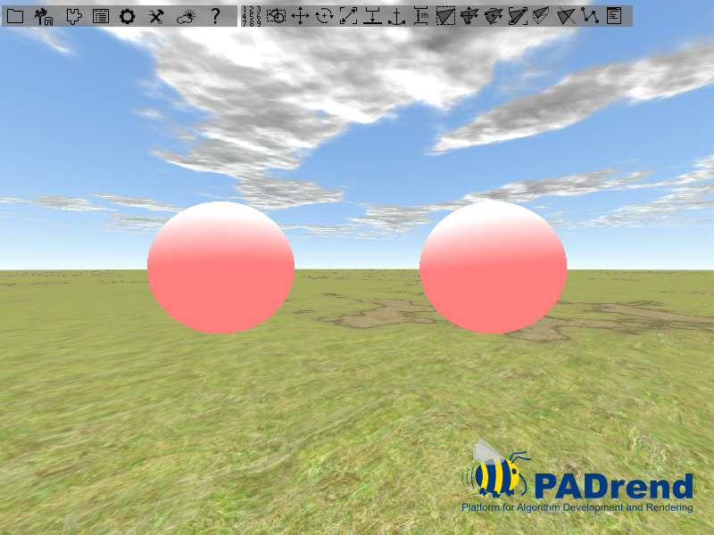
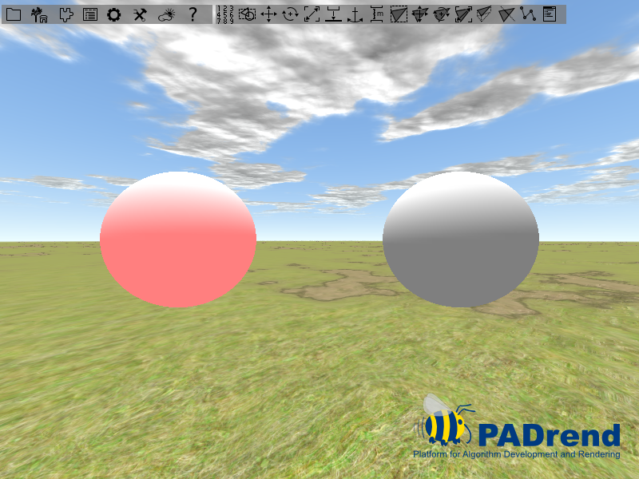

<!------------------------------------------------------------------------------------------------
This work is licensed under the Creative Commons Attribution-ShareAlike 4.0 International License.
 To view a copy of this license, visit http://creativecommons.org/licenses/by-sa/4.0/.
 Author: Florian Pieper (fpieper@mail.uni-paderborn.de)
 PADrend Version 1.0.0
------------------------------------------------------------------------------------------------->


# Lighting State
The lighting state can be used to illuminate single nodes.
In contrast, if using a light source directly, it will illuminate the whole scene.

## In this tutorial
In this tutorial you will learn the basics on creating light sources.
Two techniques of using them will be shown: using them with help of a _LightingState_ and using them directly.
The three kinds of light sources, PADrend offers, will be shortly explained.

## Scene creation
The scene is build of two spheres.
Only one of them will be illuminated.
The spheres meshes are stored in two _MinSG.GeometryNode_.
The nodes are moved a bit so that the spheres are not located at the same position.

<!---INCLUDE src=LightingState.escript, start=17, end=24--->
<!---BEGINN_CODESECTION--->
<!---Automaticly generated section. Do not edit!!!--->
```js
//creating the scene nodes
var scene = new MinSG.ListNode();

var mesh = Rendering.MeshBuilder.createSphere(50, 50);
var node = new MinSG.GeometryNode(mesh);
node.moveLocal(new Geometry.Vec3(-2, 0, 0));
var node2 = new MinSG.GeometryNode(mesh);
node2.moveLocal(new Geometry.Vec3(2, 0, 0));
```
<!---END_CODESECTION--->

To illuminate the one sphere we need some kind of light source.
PADrend offers three kinds of lights.
These lights differ in the kind of illumination:

* Point light: Point lights have a position. From this position the light is spread into all directions. For this reason they are called omni-directional.
* Directional light: Directional lights are defined by a direction vector. They spread there light evenly in this direction. Directional lights are used to model lights that are far away from the scene (e.g. simulation of sunlight).
* Spot light: Spot lights are similar to point lights, but they do not spread the light omni-directional. By a direction vector and an angle a cone is defined. Only parts of the scene that are located within this cone get illuminated. Spot lights can be used to simulate lamps. This model is more realistic than a point light. Even if you think of an light ball, there is somewhere a wire that connects it to a power source, which makes it not omni-directional.

In this tutorial we use a point light source.
To create one we need to instantiate a _MinSG.LightNode_.
As parameter, we pass the kind of light source to the constructor.

<!---INCLUDE src=LightingState.escript, start=26, end=27--->
<!---BEGINN_CODESECTION--->
<!---Automaticly generated section. Do not edit!!!--->
```js
//creating a new light node
var pointLightNode = new MinSG.LightNode(MinSG.LightNode.POINT);
```
<!---END_CODESECTION--->

Independent from the kind of light source, we need to set the lights color.
Since PADrend uses a phong shader, we have to define three parts of the lights color:

* Diffuse: This part is used in the calculation of the ideal diffuse reflection of a surface.
* Specular: This part is used in the calculation of the specular reflection of the surface.
* Ambient: The ambient part simulates the indirect light (light that is scattered from other surfaces). This part should only give a rough estimation of the indirect light.

For this tutorial we set all three parts to a red light.
Afterwards the light source is moved a bit.

<!---INCLUDE src=LightingState.escript, start=28, end=33--->
<!---BEGINN_CODESECTION--->
<!---Automaticly generated section. Do not edit!!!--->
```js
//setting the light color
pointLightNode.setAmbientLightColor(new Util.Color4f(1.0, 0.0, 0.0, 1.0));
pointLightNode.setSpecularLightColor(new Util.Color4f(1.0, 0.0, 0.0, 1.0));
pointLightNode.setDiffuseLightColor(new Util.Color4f(1.0, 0.0, 0.0, 1.0));
//move the lightsource above the scene
pointLightNode.moveLocal(new Geometry.Vec3(0, 5, 0));
```
<!---END_CODESECTION--->

After all nodes are set up the scene graph is created.
In the end we register the scene to PADrend and set it active, so that it is displayed.

## Adding a lighting state
To add a lighting state to one of the both spheres we need first to create one.
This is done by simply instantiating a _MinSG.LightingState_ object.
We pass our light source to the constructor.
This attaches the light source directly to the state without needing further method calls.
You can also attach a light source by calling _setLight_.
The state is attached to the node by calling _addState_ on the node.
The last thing we need to do is calling _setEnableLight_ on the state, so that the light source is switched on.

<!---INCLUDE src=LightingState.escript, start=41, end=45--->
<!---BEGINN_CODESECTION--->
<!---Automaticly generated section. Do not edit!!!--->
```js
//if using the LightingState, create one, attache the light node to it,
//activate it and add it to one of the geometry nodes 
var state = new MinSG.LightingState(pointLightNode);
node.addState(state);
state.setEnableLight(true);
```
<!---END_CODESECTION--->

## Difference between lighting state and using light nodes directly
Light nodes can also be used globally, so that they illuminate the whole scene.
A boolean value in the first line of the tutorials source code can be used to switch between both modes.   
If using the light source gloabally, it is just switched on.
This makes PADrend to use it for the scenes illumination until it is switched off.

<!---INCLUDE src=LightingState.escript, start=48, end=49--->
<!---BEGINN_CODESECTION--->
<!---Automaticly generated section. Do not edit!!!--->
```js
//otherwise just switch on the light node
pointLightNode.switchOn(frameContext);
```
<!---END_CODESECTION--->

The image below shows the resulting illumination.
You can see that both spheres are illuminated by the light node.




If using the light state instead, only the sphere that has the state attached to it is illuminated.




