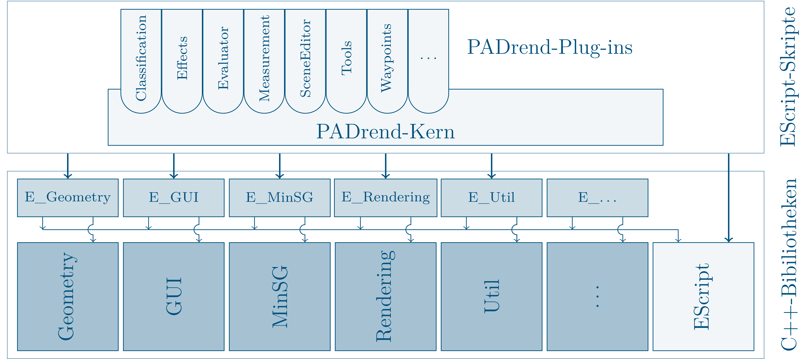

## TODO

* ... Extension Points ( + "Important Extensions")?
* ... Evtl. Geometry Library Tutorials hier? (gemerged in einem Tutorial?)

## PADrend
PADrend stands for Platform for Algorithm Development and Rendering – a software system for virtual walkthroughs through complex virtual three dimensional scenes.
PADrend is developed since 2007 in the research group Algorithms and Complexity at the Heinz Nixdorf Institute, University of Paderborn.
The goals of PADrend are the harmonization of development efforts, the establishment of a basis to compare 3D rendering algorithms, and the provision of an adequate basis for research and teaching.
Among other things, PADrend is utilized to develop and evaluate new rendering algorithms, to support students in writing their bachelor's and master's theses, and to do design reviews of complex visual scenes on the HD visualization center.

## PADrend's internal structure
For rendering PADrend uses OpenGL.
Since the library is supported by many platforms, PADrend compiles on Windows, Linux and OS X.
PADrend's libraries are mainly written in C++ 11.
The libraries are used to wrap OpenGL functionalities, to make them more easy to use.
They also handle platform specific functions and provide you with functionalities that make programming more easy.  
In the previous tutorials EScript was introduced to you.
EScript plays a huge role in the design of PADrend.
For most of the libraries C++ classes there is a wrapper class which makes it accessible to EScript scripts.
For each library there is a folder, stating with an E_ and ending with the libraries name, which contains all of the libraries wrapper classes.  
PADrend's core is written in EScript.
It uses the functionality provided by the libraries, combines them and creates the actual application.
PAdrend ships with a lot of plugins, which extend its capabilities.
You can also create your own plugins.
The plugins are located in the _plugins_ folder.
It also contains some library extensions, which are also written in EScript and provide you withe even more useful functionalities.

### Library overview
* Geometry: In computer graphics you often have to deal with vectors and transformation matrices. The Geometry library offers you classes for most of the geometry problems you may be faced with.
* GUI: Provides you with PADrend's graphical user interface framework.
* MinSG: Defines PADrend's scene graph. It also contains of the graphs nodes as well as states that enable single nodes or a group of nodes to be rendered in a specific way. Never mind if you are node familiar with scene graphs. There will be tutorials on it.
* Rendering: Handles everything that has something to do with rastering objects to the screen. It contains the wrapping of OpenGL, handeling textures, managing of meshes, the handling of shaders and a wrapper for OpenCL.
* Sound: Classes for basic sound output.
* Util: Here you find useful stuff like IO, networking, bitmaps and timers. Also you can find the actual window of the application here. A lot of platform depended functions are wrapped for you. In this way you can code platform independent.

## PADrend's Livecycle
When you start the PADrend executable, first of all the EScript runtime and wrapper libraries are initialized.
This steps ensures that you can use PADrends C++ libraries in your EScript code.
Next up the execution environment reads the filename of the main-script from the command line, loads and executes it.
In the main-script first of all EScript Std library and PADrend's config file are loaded.
If you start PADrend for the first time, an empty config file will be created.
After that the script hands over the control to PADrend.escript.
There is a default location of PADrend.escript in the config file.
If you need to adapt it for some reason, there is the place where you can do so.
In the PADrend.escript script first of all the core plugins will be loaded.
Next up some global variables like the frame context and rendering context are created.
After that the PADrend plugin is loaded.  
So PADrend itself is a plugin.
As a plugin, it defines some extension points.
You will learn about extension points later on.
For now you just need to know that you can attach your own callback functions to them.
Whenever a extension get called, your callback function will be called.
In this way you get informed about events (for example the closing event of PADrend).
First of all plugin loads all plugins defined in the config file and then it calls the extension 'PADrend_Init'.
Then it loads the graphical user interface module.
After that the autorun script is executed.
By default there is none, but you can write one if you need it.
You need to enter its location in the config file.
At the end the extension 'PADrend_Start' is executed, which hands over the control to the event loop.

### The Event Loop
In the listing below you can see PADrend's event loop.

	while active:
		execute ’PADrend_BeforeRendering’
		for each rendering-pass:
			execute extension ’PADrend_BeforeRenderingPass’
			render the pass with containing scene and camera
			execute extension ’PADrend_AfterRenderingPass’
		execute extension ’PADrend_AfterRendering’
		handle planned tasks
		fetch events (mouse, keyboard, . . . )
			for each event execute ’PADrend_UIEvent’ (or ’PADrend_KeyPressed’).
		execute extensions ’PADrend_AfterFrame’
		swap buffer
	execute extension ’PADrend_Exit’

The first line in the loop creates the rendering-passes and prepares the system for rendering.
Then for each rendering pass the containing scene is rendered.
When the extension ’PADrend_AfterRendering’ executed, the GUI is drawn, as it registers its draw function to the extension.
After that all events are processed.
There is  one extension to ’PADrend_UIEvent’ handles the camera movement (’PADrend/Navigation’-plugin).
If you need some key handling in one of your projects, just register your own extension.
After that swap buffer is used to swap the window's front and back buffer.
When the loop is stopped, 'PADrend_Exit' will be called and PADrend shuts down.

## Extension points
TODO

### Important Extensions
This chapter will describe different important PADrend extensions.

#### General PADrend events
##### `PADrend_Init` (one time)
 Called before the main loop starts. This is an one time event.

##### `PADrend_Start`
Called after initialization (the eventLoop is executed here)

##### `PADrend_Exit`
Called before program is closed. Can be used to free handles, close network connections....

##### `PADrend_Message` with parameter: `String message`
Can be executed by a call to `PADrend.message`. PADrend has registered itself as a receiver for this event and it will output the message surrounded with `[[--` and `--]]`.

#### EventLoop Extensions
##### `PADrend_KeyPressed` (chained) with parameter: `Util.UI.Event event`
The extensions are executed for key presses on the keyboard. The event (see [Util.UI.Event](UI.Event.md)) describing the key press is given as parameter. This is a chained extensions, if `true` or `Util.EXTENSION_BREAK` is returned the event is not processed by further handlers.
> Extensions for this extension point are not executed for key releases!

##### `PADrend_UIEvent` (chained) with parameter: `Util.UI.Event event`
The extensions are executed for user interface events. The event (see [Util.UI.Event](UI.Event.md)) description is given as parameter.
For example, the events can be caused by a mouse move, mouse button, keyboard, or joystick.

##### `PADrend_BeforeRendering` with parameter: `RenderingPass passes...`
Called before the rendering passes are executed. The only thing you probably want to do here is to modify or create rendering passes.
> When you are not implementing multiple rendering passes or want to perform fullscreen effects, this is NOT the right extension point for you! Have a look at 'PADrend_AfterFrame' instead.

##### `PADrend_BeforeRenderingPass` with parameter: `RenderingPass pass`
Called before each rendering pass is executed. Here is e.g. the place to push FBO's for postprocessing effects.

##### `PADrend_AfterRenderingPass` with parameter: `RenderingPass pass`
Called after each rendering pass is executed. Here is e.g. the place to pop your FBO's or to annotate the final image.

##### `PADrend_AfterRendering` with parameter: `MinSG.AbstractCamera camera`
Called after rendering has finished.

##### `PADrend_AfterFrame`
Called before the rendering buffer is swapped. Extensions should not modifiy the rendering buffer here, but can exploit the time until the rendering is finished for various other tasks. E.g. :
* Update the Camera
* Update gui data
* Execute commands

##### `PADrend_OnAvgFPSUpdated` with parameter: `Number fps`
In regular intervals (normally every 0.5sec), the average fps is recalculated and passed to interested listeners registered to this extension point.

#### SceneManagement
##### `PADrend_OnSceneSelected` with parameter: `scene`
Called when a scene is selected.

##### `PADrend_OnSceneListChanged` with parameter: `Array scenes`
Called when the list of available scenes changed. Do not alter the array of scenes!

##### `PADrend_OnSceneRegistered` with parameter: `root`
Called when a new scene is registered (e.g. after loading). The parameter is the new scene's root node.

#### SceneEditor/ObjectPlacer
##### `ObjectPlacer_OnObjectInserted` with parameter: `MinSG.Node node`
Called whenever an object (=node) has been inserted
