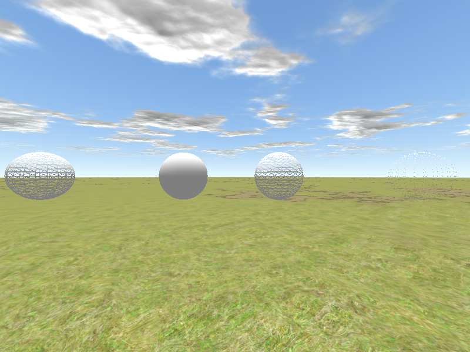

<!------------------------------------------------------------------------------------------------
This work is licensed under the Creative Commons Attribution-ShareAlike 4.0 International License.
 To view a copy of this license, visit http://creativecommons.org/licenses/by-sa/4.0/.
 Author: Florian Pieper (fpieper@mail.uni-paderborn.de)
 PADrend Version 1.0.0
------------------------------------------------------------------------------------------------->


# Goal of this tutorial
In this tutorial you will learn some functions of the _MehsBuilder_.
It can be used to create meshes in an easy way.

# Creating a box by using PADrend's _MeshBuilder_
A box is made of six quads which are arranged together.
It contains of eight vertices, which are the corners of the box.
Before building a box we need first to instantiate a _MeshBuilder_ object.

<!---INCLUDE src=MeshBuilderTut.escript, start=56, end=56--->
<!---BEGINN_CODESECTION--->
<!---Automaticly generated section. Do not edit!!!--->
```js
var meshBuilder = new Rendering.MeshBuilder();
```
<!---END_CODESECTION--->

The mesh builder is than feed with the eight corners of the box.
Note that the method _addVertex_ takes eight parameters.
The first parameter is the position of the vertex.
It takes a _Geoemetry.Vec3_.
The second parameter also takes a _Geoemetry.Vec3_ and defines the normal of the vertex.
The following four parameters are responsible for color of the vertex.
It needs to be given in RGBA format.
The last two parameters define the texture coordinates.
When a vertex is added to the _meshBuilder_, it is placed at the end of a list.
The _addVertex_ method returns the index of the vertex within the list.
Initially the list is empty, so that the first vertex gains index 0.

<!---INCLUDE src=MeshBuilderTut.escript, start=58, end=67--->
<!---BEGINN_CODESECTION--->
<!---Automaticly generated section. Do not edit!!!--->
```js
//Adding the vertices
meshBuilder.addVertex(new Geometry.Vec3(0,0,0), new Geometry.Vec3(0,0,1), r, g, b, 1, 0, 0);//0
meshBuilder.addVertex(new Geometry.Vec3(0,1,0), new Geometry.Vec3(0,0,1), r, g, b, 1, 0, 0);//1
meshBuilder.addVertex(new Geometry.Vec3(1,1,0), new Geometry.Vec3(0,0,1), r, g, b, 1, 0, 0);//2
meshBuilder.addVertex(new Geometry.Vec3(1,0,0), new Geometry.Vec3(0,0,1), r, g, b, 1, 0, 0);//3

meshBuilder.addVertex(new Geometry.Vec3(0,0,-1), new Geometry.Vec3(0,0,-1), r, g, b, 1, 0, 0);//4
meshBuilder.addVertex(new Geometry.Vec3(0,1,-1), new Geometry.Vec3(0,0,-1), r, g, b, 1, 0, 0);//5
meshBuilder.addVertex(new Geometry.Vec3(1,1,-1), new Geometry.Vec3(0,0,-1), r, g, b, 1, 0, 0);//6
meshBuilder.addVertex(new Geometry.Vec3(1,0,-1), new Geometry.Vec3(0,0,-1), r, g, b, 1, 0, 0);//7
```
<!---END_CODESECTION--->

Now it is time to create the six squares based on the vertices.
Each is build from two triangles (since triangles are the smallest unit when it comes to computer graphics) and contains four vertices.
To build a quad we need to tell PADrend which vertices should result in a quad, based on the vertices indices.
It is important to notice that the indices have to be added in counter clockwise order.
This is needed by back-face culling to decide whether the back-face or front-face of a polygon is visible to the viewer.
If the indices are added in clockwise order, the culling algorithm would cull the polygon, since it assumes that back-face is visible to the viewer.
 The _MeshBuilder_ offers three method to add indices, which will be introduced in the following.

## Adding indices one by one
The first way of arranging four vertices to a quad, is to add its indices one by one.
For a quad we need two triangles.
Since each triangle contains of three vertices, we need to add six indices in total.
In order to add an index we have to call _addIndex_ and pass it a vertices index.
Here the method is used to create the front side of the box.
Note that the indices for the two triangles are added in counter clockwise order for the reasons described above.

<!---INCLUDE src=MeshBuilderTut.escript, start=69, end=78--->
<!---BEGINN_CODESECTION--->
<!---Automaticly generated section. Do not edit!!!--->
```js
//Front side
//First triangle
meshBuilder.addIndex(0);
meshBuilder.addIndex(3);
meshBuilder.addIndex(2);

//Second triangle
meshBuilder.addIndex(0);
meshBuilder.addIndex(2);
meshBuilder.addIndex(1);
```
<!---END_CODESECTION--->

## Adding triangles directly
In addition of adding the indices one by one, the _MeshBuilder_ also allows for adding a triangle with a single method call.
Therefore we need to call _addTriangle_ and pass it the three indices of the triangle in counter clockwise order.

<!---INCLUDE src=MeshBuilderTut.escript, start=80, end=82--->
<!---BEGINN_CODESECTION--->
<!---Automaticly generated section. Do not edit!!!--->
```js
//Top side
meshBuilder.addTriangle(2,6,5);
meshBuilder.addTriangle(1,2,5);
```
<!---END_CODESECTION--->

## Adding quads directly.
Last but not least it is also possible to add quads directly.
The methods takes four indices and creates automatically two triangles in order to build a triangle.

<!---INCLUDE src=MeshBuilderTut.escript, start=84, end=85--->
<!---BEGINN_CODESECTION--->
<!---Automaticly generated section. Do not edit!!!--->
```js
//Back side
meshBuilder.addQuad(4,5,6,7);
```
<!---END_CODESECTION--->

## Finalizing the mesh
After we are done adding all our vertices and triangles to our mesh builder, we can finalize our mesh.
This can be simply done by calling _buildMesh_.
<!---INCLUDE src=MeshBuilderTut.escript, start=94, end=95--->
<!---BEGINN_CODESECTION--->
<!---Automaticly generated section. Do not edit!!!--->
```js
//Build the mesh
var mesh = meshBuilder.buildMesh();
```
<!---END_CODESECTION--->

## Displaying mesh
To display the mesh we first need to register a scene.
Therefore we need a scene graph.
In PADrend the scene graph is called _MinSG_, which stands for minimal scene graph.
It contains of different kinds of nodes and will be described in a following tutorial in more detail.
First of all we need a _ListNode_ which represents the root of the graph.
A _ListNode_ can be used to held other nodes, but does not contain any geoemetry.
So we need another node to store our mesh.
For this purpose we use a _GeometryNode_.
It can be added to the scene node by the _+=_ operator.
After the scene graph was build, we register the root node at the PADrend instance and select it to be the active scene, so that it is displayed.
<!---INCLUDE src=MeshBuilderTut.escript, start=99, end=109--->
<!---BEGINN_CODESECTION--->
<!---Automaticly generated section. Do not edit!!!--->
```js
//Create a list node holding the scene
var sceneNode = new MinSG.ListNode();
//Create a geometry node holding the mesh
var node = new MinSG.GeometryNode(mesh);
//Adding the geometry node to the scene node
sceneNode += node;
    
//Register the scene
PADrend.registerScene(sceneNode);
//Selecting the scene to make it active
PADrend.selectScene(sceneNode);
```
<!---END_CODESECTION--->

# Creating predefined meshes
Beside building meshes from a list of vertices, the _MeshBuilder_ also offers the creation predefined meshes.
Therefore there is a number of class methods for the different meshes.

* _createArrow_ creates an arrow. Takes the radius of the arrows cone as first parameter. The second parameter defines the arrows length.
* _createCone_ creates a cone by three parameters. The first parameter sets the radius, the second the height of the cone. The third parameter defines the number of segments the cone is made of. The more segments the rounder and smoother the cone appears. As a downside the number of triangles increases.
* _createConicalFrustum_ creates a cone, having its tip cut off by four parameters. The first and second parameter sets the radius of the bottom and top. The third parameter defines the height and the fourth one defines the number of segments.
* _createDiscSector_ creates a disc-sector by an angle. The first parameter defines the discs radius. The second parameter sets the number of segments used to create the disc. The third parameter sets the opening angle of the sector.
* _createDome_
* _createRectangle_ creates a rectangle. The first (optional) parameter takes a vertex description. The second and third parameter define the width and height of the rectangle.
* _createRingSector_ creates a sector of a ring. The first and second parameter set the inner and outer radius of the ring. The third parameter sets the number of segments used to create the ring section. The fourth parameter defines the opening angle of the sector.
* _createSphere_ creates a sphere, having a fixed radius. The first and second parameter set the number of segments in horizontal and vertical direction.
* _createBox_ creates a box. Takes a _Geometry.Box_, defining the size, as parameter.

# Draw modes
PADrend offers you to render meshes in four different draw modes.
Function _createThreeConesWithDifferentDrawState_ shows their effect and how they are used.
Therefore four spheres are instantiated by using the predefined meshes described above.
For each mesh a different draw mode is set by calling one of the following methods:

* _setDrawTriangles_ draws a solid mesh. This mode is set by default.
* _setDrawLines_ draws lines connecting the vertices in a rectangular shape.
* _setDrawLineStrip_ displays the meshes triangles as lines.
* _setDrawPoints_ draws only the meshes vertices as dots.

<!---INCLUDE src=MeshBuilderTut.escript, start=25, end=41--->
<!---BEGINN_CODESECTION--->
<!---Automaticly generated section. Do not edit!!!--->
```js
    var numSegments = 20; //number of segments in horizontal and vertical direction

    var mesh1 = Rendering.MeshBuilder.createSphere(numSegments, numSegments);
    var mesh2 = Rendering.MeshBuilder.createSphere(numSegments, numSegments);
    var mesh3 = Rendering.MeshBuilder.createSphere(numSegments, numSegments);
    var mesh4 = Rendering.MeshBuilder.createSphere(numSegments, numSegments);
    
    //Setting draw modes
    mesh1.setDrawTriangles(); //inital setting
    mesh2.setDrawLines(); //draw lines only, rectangular shaped
    mesh3.setDrawLineStrip(); //draw lines only, triangular shaped
    mesh4.setDrawPoints(); //draw only points (positions of vertices) 
    
    var node1 = new MinSG.GeometryNode(mesh1);
    var node2 = new MinSG.GeometryNode(mesh2);
    var node3 = new MinSG.GeometryNode(mesh3);
    var node4 = new MinSG.GeometryNode(mesh4);
```
<!---END_CODESECTION--->

The four spheres are positioned next to each other, so that you can observe the effect of the different modes.

<!---INCLUDE src=MeshBuilderTut.escript, start=43, end=47--->
<!---BEGINN_CODESECTION--->
<!---Automaticly generated section. Do not edit!!!--->
```js
//Setting positions
node1.setRelPosition(new Geometry.Vec3(-2, 0, 0));
node2.setRelPosition(new Geometry.Vec3( 2, 0, 0));
node3.setRelPosition(new Geometry.Vec3(-8, 0, 0));
node4.setRelPosition(new Geometry.Vec3( 8, 0, 0));
```
<!---END_CODESECTION--->



From left to right you can see _setDrawLineStrip_, _setDrawTriangles_, _setDrawLines_ and _setDrawPoints_.

<!--TODO add codesection here-->

# Cutting mesh
In some scenarios it might be useful to cut a mesh by a plane (e.g. to show the inside of a machine).
In PADRend this can be done by using the function _	Rendering.eliminateTrianglesBehindPlane_.
An example usage is shown ins  _clipSphere_.
The function takes three parameters.
First of all the mesh, that should be cut, is passed to it.
The second and third parameter define a plane by a position and direction vector.
The function clips all triangles lying on the opposite of the direction vector.

<!---INCLUDE src=MeshBuilderTut.escript, start=15, end=19---> 
<!---BEGINN_CODESECTION--->
<!---Automaticly generated section. Do not edit!!!--->
```js
    var numSegments = 20; //number of segments in horizontal and vertical direction
    var mesh = Rendering.MeshBuilder.createSphere(numSegments, numSegments);

    //Cutting the mesh
    Rendering.eliminateTrianglesBehindPlane(mesh, new Geometry.Vec3(0.0, 0.0, 0.0), new Geometry.Vec3(-1.0, 0.0, 0.0));
```
<!---END_CODESECTION--->


