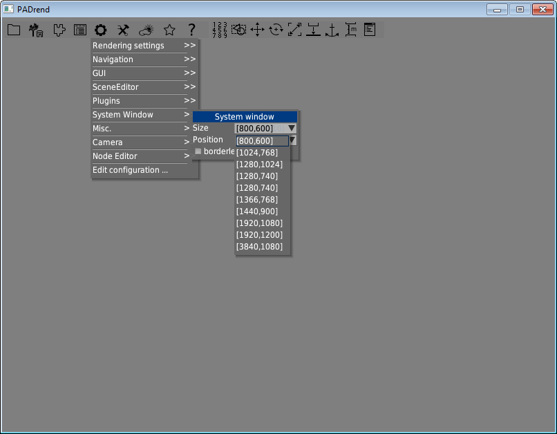
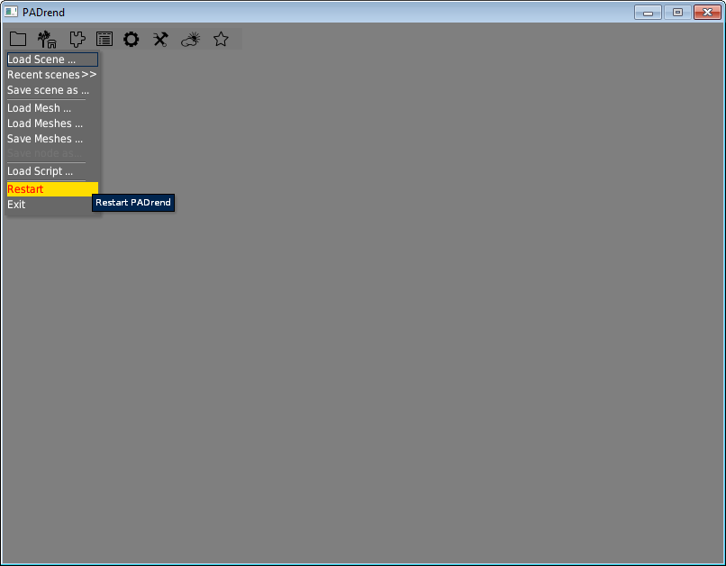
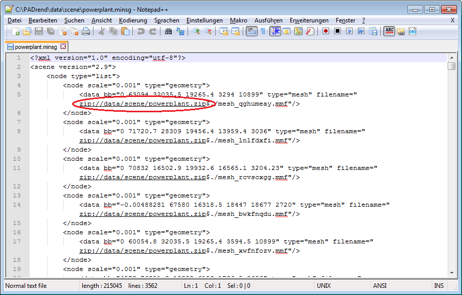
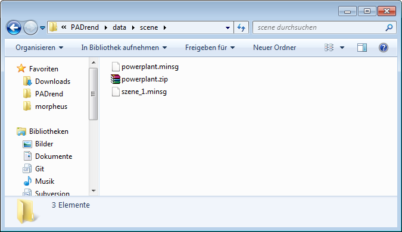
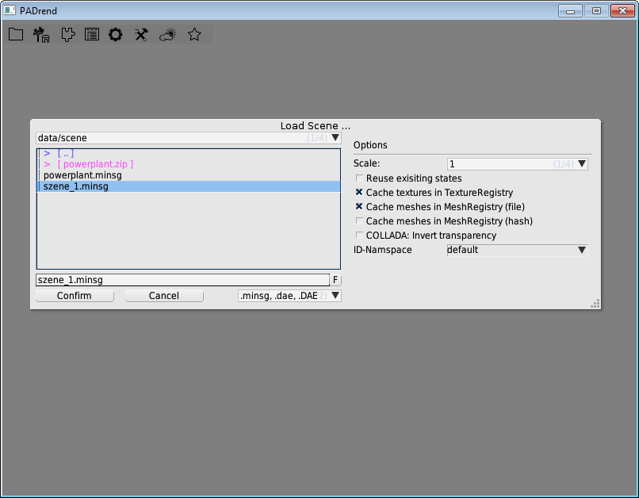
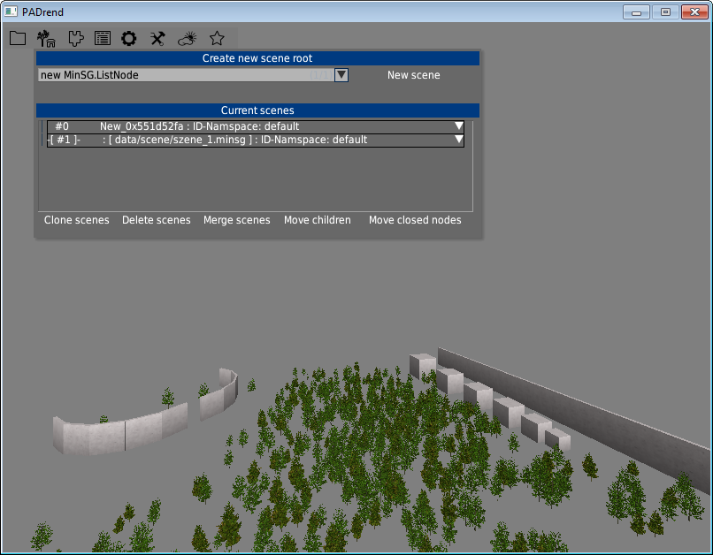
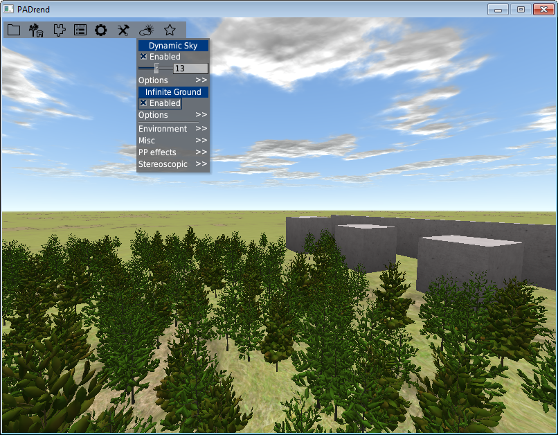
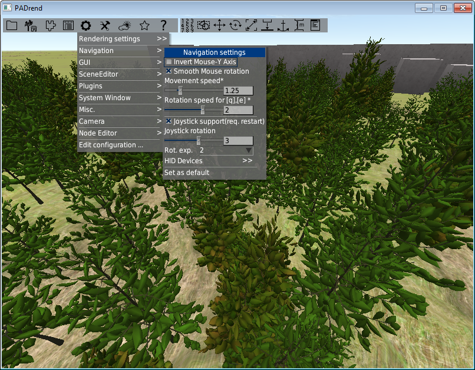

<!------------------------------------------------------------------------------------------------
This work is licensed under the Creative Commons Attribution-ShareAlike 4.0 International License.
 To view a copy of this license, visit http://creativecommons.org/licenses/by-sa/4.0/.
 Author: Florian Pieper (fpieper@mail.uni-paderborn.de)
 PADrend Version 1.0.0
------------------------------------------------------------------------------------------------->

# Goal of this tutorial
In this tutorial you will learn some basics techniques for working with PADrend.
In the first part we will load the first scene.
This is a crucial step since most of the time you are using PADrend you will have to deal with scenes.
The second part is about navigation.
You will learn to move through a scene in three different ways, namely by keyboard, by mouse and by gamepad.

# Assumption
To finish this tutorial you need a working installation of PADrend.
For installation hints follow the [Building PADrend from Source](../../Installation Guide/InstallationGuide) guide.

# Setting up PADrend
Let's start PADrend.

* Linux: Open a terminal and navigate to the PADrend folder.
  Type _./build/PADrend/PADrend_ to start PADrend.
* Windows: Open the PADrend folder.
  Start the PADrend.exe.

First of all you should choose a window size that fits to the screen resolution of your computer.
Open PADrend and go to the _config_ menu.
Choose _System Window_ and use the _Size_ drop-down menu to alter the window size.

Restart PADrend by using the _Restart_ button in the file menu PADrend and it should open with correct size.

# Import and load a scene
There a two kinds of scenes.
The first kind are scenes that contain of a single file.
The single file includes also all of the senes meshes.
In contrast there a scenes that split the secne information (such as for example the positioning of objects) and the objects meshes into different files.  
Now that PADrend is running with a proper window size we can go on and load the first scene.
Before we can do so it has first to be imported.
In this tutorial we will use the szene_1 scene.   

## Placing the scene
Before you can load a scene you should copy it to a common folder.
Therefore first navigate to the _data_ folder, which you find in the PADrend's main directory.
Create a folder _scene_ and copy the file _szene_1.minsg_ to it (see [szene_1.minsg](../models/szene_1.minsg)).

## Finding the correct folder for a scene having a separate mesh file
For scenes made from multiple files it is important to place the files in the correct folder.
Otherwise the file containing the meshes may not be found.
This part shows you how to find the correct folder.
Note that the used scene is not included in the repository.   
To find the correct folder open the scenes _.minsg_ file in a text-editor.
You can extract the path to place the scene of one of the _filesname_ attributes.

The path (normally it should be _/data/scene_)is relative to the PADrend working directory.
Check whether it exists and if not created it.
Copy both, the .minsg and the .zip file, to the directory.

## Load the scene
Let's load the scene.
Open PADrend.
Go to the _file_ menu and choose _Load Scene..._.
Select szene_1.minsg and hit _Confirm_.
The scene will be loaded.

This may take some seconds.
After loading a scene for the first time you can also load it via main menu using _Recent Scenes_.
Press space to reset the camera.

## Switch between loaded scenes
PADrend offers you the possibility to load multiple scenes at the same time.
This can for example be used to copy nodes from one scene and paste them to another.
How this works is content of a later tutorial.
To switch between the loaded scenes open the _Scenes_ menu.
You will find the currently loaded scenes in the _Current scenes_ list.
Scene \#0 is the empty scene that is created at the startup of PADrend.
To switch between to another scene choose one form the list by clicking on it.
You may have noticed the white triangle on the left beside each entry.
Clicking on it will provide you with the meta information of the scene.
This are for example the title of the scene and the author who created it.

##Enable infinite ground and dynamic sky.
You may have noticed that the scene has no ground.
To activate the ground go to the _Effects_ and check _Enable_ checkbox under _Infinite Ground_.
Underneath the checkbox you can find a menu item _Options_.
It offers you some setting for the ground such as six different ground types.
You can activate the dynamic sky in a similar way in the _Effects _menu.
Again you can use _Otions_ to customize it.
Experiment with the setting for the ground and the sky if you like to.

# Navigation
After we have loaded the scene let us start moving around a bit.
Navigation in PADrend can be done in three different ways.
You can use the keyboard, the mouse, a gamepad or a combination.
There is a complete keybindings overview in your PADrend directory under _PADrend/doc/Help.txt_.

## Keyboard navigation
* Use the keys [w], [a], [s] and [d] for moving forward, left, backward and right.
  You will move in the direction of the camera.
  If the camera for example looks slightly down in an angle and you press [w] you will move down with this angle.
* Use the keys [q] and [e] to rotate the camera.
* Use the keys [r] and [f] to move the camera up and down.
* Use [space] to reset the camera. 
* Use [Numpad 5] to move the camera above the whole scene.

## Mouse navigation
To use mouse navigation you need first to activate it.
Press either the key [m] or the middle button of your mouse (in modern mouses by pressing the mousewheel down).
Now you can take a look around by moving the mouse.
Practice a while until you feel comfort with it.
It is also possible to move around by using the mouse.
While in mouse navigation mode press down and hold the left mouse button.
If you now move the mouse backwards and forwards you will move backwards and forwards.
Same applies for left and right movement.
If you press and hold the right mouse button instead you will move up and down when moving the mouse backwards and forwards.
To exit the mouse navigation mode use again the [m] key or the middle mouse button.

## Gamepad navigation
Using a gamepad results in a smooth movement.
Before you can use it for the first time you have to activate it.
Go to _Config_ and enable _Joystick support_ under the entry _Navigation_.

Use the left analog stick for moving backward, forwards, left and right.
If you press and hold the gamepad's [5] key while using the left analog stick you will move up and down instead of backwards and forwards.
With the right analog stick you can rotate the camera left, right, up and down.

## Up to you
Now that you know how to navigate try to find and reach the pig.
