<!------------------------------------------------------------------------------------------------
This work is licensed under the Creative Commons Attribution-ShareAlike 4.0 International License.
 To view a copy of this license, visit http://creativecommons.org/licenses/by-sa/4.0/.
 Author: Florian Pieper (fpieper@mail.uni-paderborn.de)
 PADrend Version 1.0.0
------------------------------------------------------------------------------------------------->

# Goal of this tutorial
In this tutorial we will build a small factory hall.
In the first part you will learn about the difference between scene graph nodes and semantic objects.
In the second part we will put a forklift into the scene and use an animation to move it around.

# Assumption
Tutorial 2 is finished.
PADrend is opened and an empty scene is loaded.
Infinite ground and dynamic sky are enabled.

# Preparing the scene
Before we can start, we need to have an empty factory hall in our scene.
Add the factory library (see [Fabrik](../models/Fabrik.zip)) to the object placer just like you did it in Tutorial 2.
Open the object placer and position an instance of _HalleBackstein_ on the ground.
Locate the factory hall in move inside.

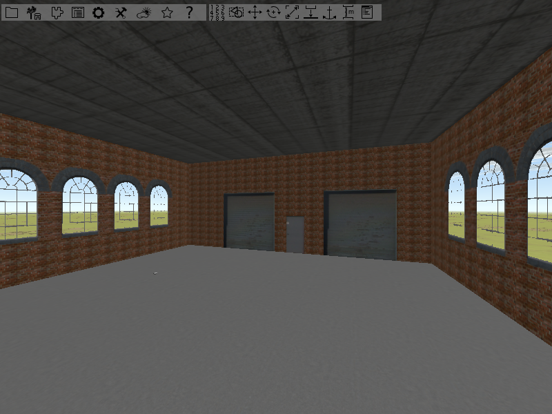

# Nodes vs semantic objects
PADrend differentiates between nodes and semantic objects.
A node is simply a node of the scene graph.
In contrast, a semantic object contains a group of nodes that together form a semantic unit.
Think about a car, modeled by a body and four wheels, so that in total the car is build form five parts.
Each single part is a node in the scene graph, where car itself is a semantic object.  
As you have seen in Tutorial 2, we can also group a bunch of nodes in a common subtree.
If you want to select nodes you can use the techniques described in Tutorial 2.
For object selection the techniques must be slightly changed.
For the mouse selection you also have to hold down [ctrl], but instead of using the left mouse button you have to use the right one.
If you want to use the selection tool you must alter its settings.
Open the context menus and activate _incl. sem. obj._.
Now you can use the selection tool to select objects.

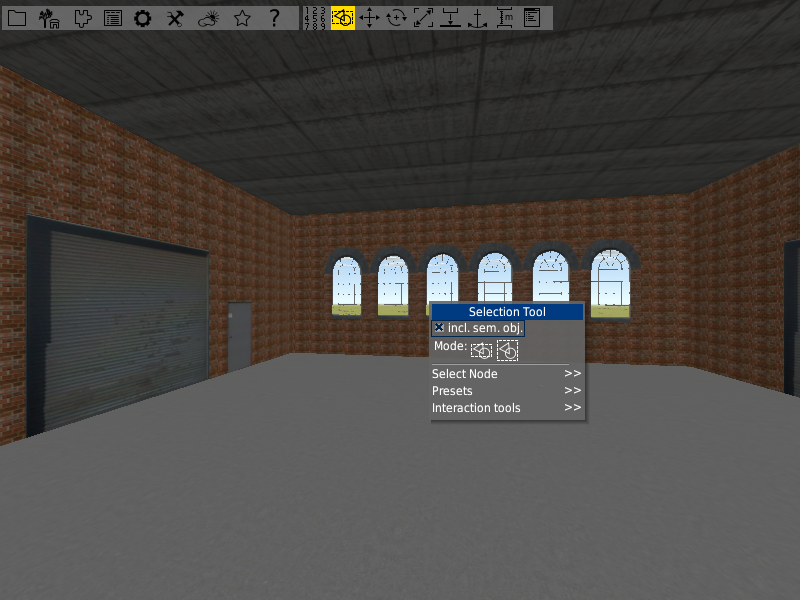

If you select something, the description box above the selection shows you whether you have selected a node or a semantic object.
For ordinary nodes there is a black description box, for semantic objects there is a green one.

## Marking nodes as semantic objects
The factory hall is empty till now.
Lets fill it with a small production line.
Place two instances of _Rollen_Gerade_Lang2_ in the hall.
Use two instances of _Rollen_Kurve_180_ to connect them (one of them needs to be rotated by 180 degrees).
Pay attention to the alignment.
In the end it should look like in the image below.

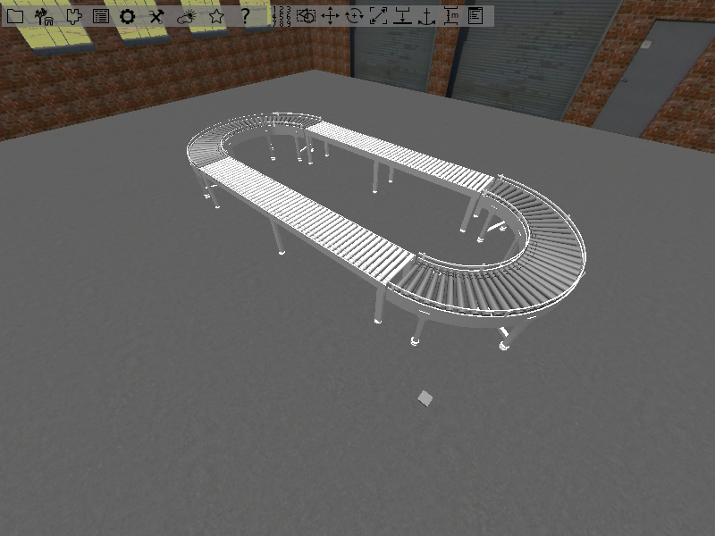

Now that we have build our production line, we want it to become a semantic object.
Select the four parts of the production line by using one of the object selection techniques.
Group the selected objects in a common subtree as you did in the last tutorial.
You may notice that the newly established node has a black description field on it.

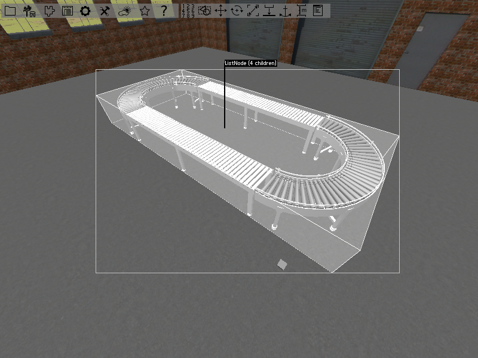

So we have not created a semantic object till now.
But we can convert the node to become a semantic object.
Open the _Main Window_  by using the item in the toolbar or by pressing [F1].
You can find the selected node in the _Node Editor_.
Activate _is semantic object_ to convert the node.
The description field will turn to green.
You can turn a semantic object into a node in the same way.

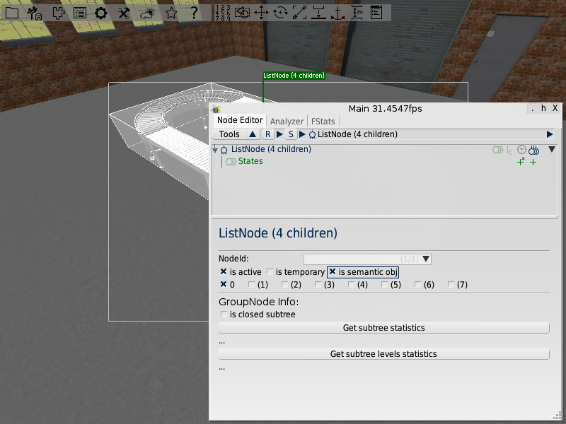

If you perform an object selection on one of the parts of the production line, the whole production line will be selected.
You can use [pgDown] to traverse to the sub objects.  
Since we want the forklift to drive around the production line, place it about in the middle.
Feel free to place other objects so that it look more like a factory.
The image below shows an example, but you can use other objects if you like.
Just keep in mind that we need some space for the forklift to drive.

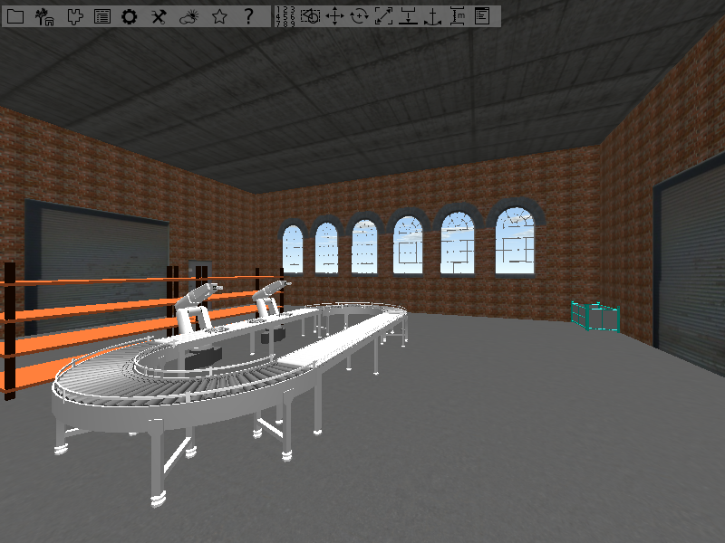

Do not forget to place a forklift in your factory hall.
It is called _Gabelstapler_ in the object placer.
Also give the semantic object an identifier.
Select it, open the _Main window_ by pressing [F1] or using the menu bar item and type in forklift in the text field _NodeId_.

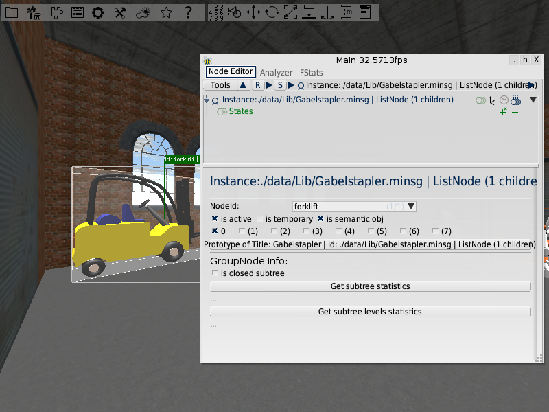

Its orientation should be similar to the one you can see in the image below (e.g it should point away from the walls).

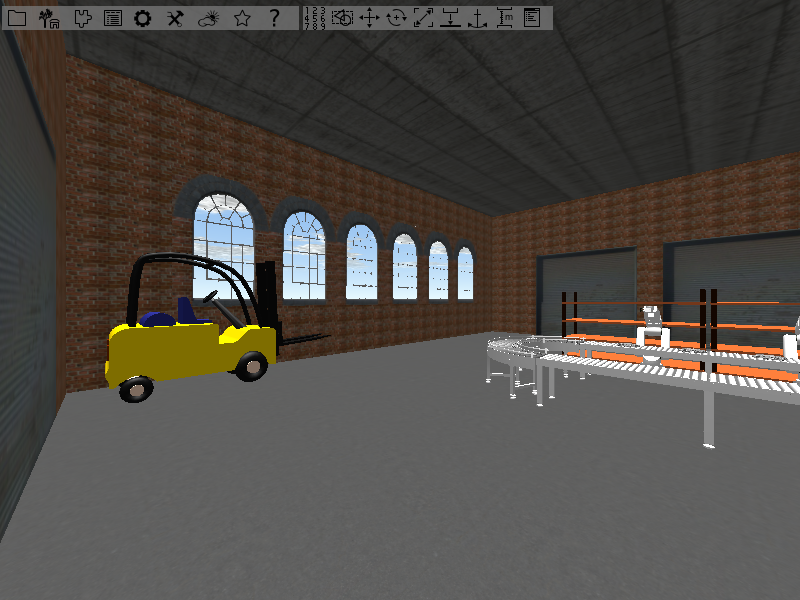

# Traits: Get the forklift move
Traits are used to add abilities to semantic objects.
An object trait is a enclosed unit that serves one specific task.
The name of an object trait should describe what its task is.
PADrend offers predefined traits for different tasks.
For example: There are some traits for different animations.
Beside the predefined traits you can also write your own traits.  
To get the forklift moving, we have to add a key frame animation to it.
In key frame animation several position (key frames) of the object that should be animated are stored.
The user transforms the object between two positions (e.g translations, rotations and scalings).
The animation interpolates form the one position to the other.
It is important to notice that the key frame animation may use other transformations than the user did.
If the user for example rotates the object between to positions by 180 degrees and than rotates it back by 90 degrees the animation will only perform a 90 degree rotation.  

## The object explorer
The _Object explorer_ is, just like the _ObjectPlacer_, a part of the _Scene Editor Window_.
It show in a tree view all semantic objects of the scene.
If you open it you will only see the top most element of the tree.
Use the small triangle to show the scenes objects.
If you click on an object in the tree, the corresponding object in the scene gets selected.

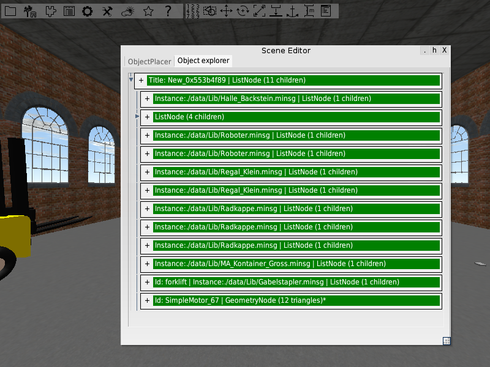

## Adding a key frame animation
Lets add a _KeyFrameAnimation_ trait to the forklift.
Open the _Object explorer_ and locate the forklift object.
Expand the object via a click on the _+_.
Click on _Add object trait_ and choose _Animation/KeyFrameAnimation_ from the list.

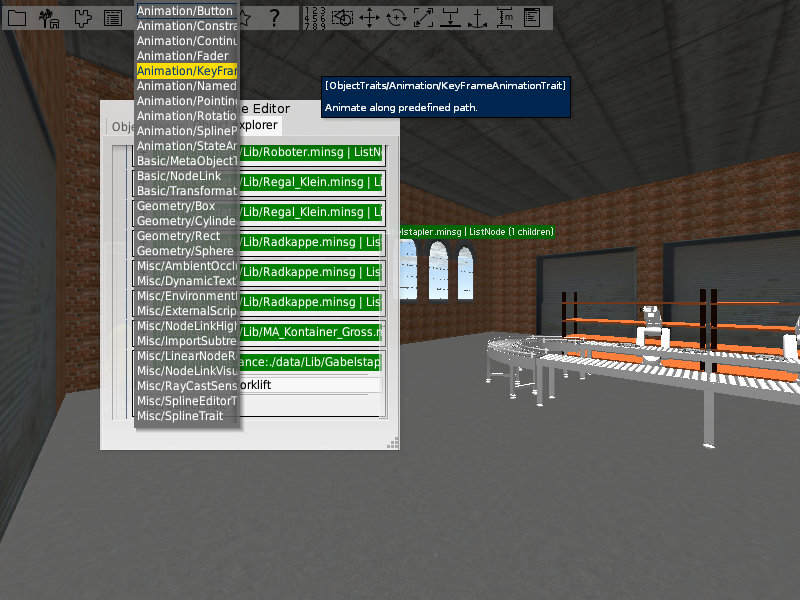

You will notice that now there are some two entries at the forklift object.
The _KeyFrameAnimation_ trait it self and a _NodeLink_ trait where added.
We will need the _NodeLink_ trait later to connect the animation to an animator.
But for now we do not care about it and create the key frames for the animation.

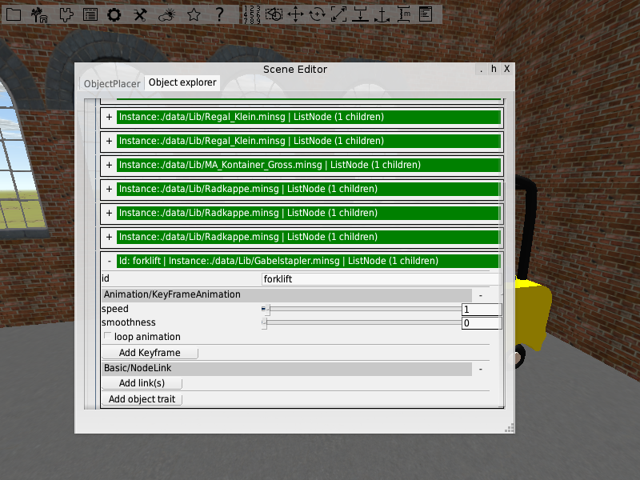

The first key frame is the initial position of the forklift.
Press the _Add Keyframe_ button to add it.
Now move the forklift forward into the next corner of the factory hall and add another key frame.

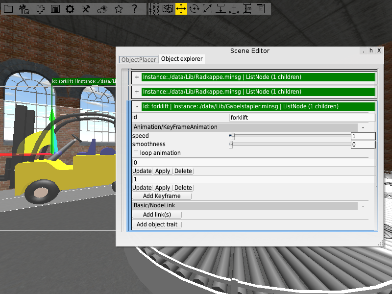

You may have noticed the three buttons underneath each key frame.
	* Update: Sets the position stored in the corresponding key frame to the actual position of the object.
	* Apply: Moves the object to the position stored in the key frame.
	* Delete: Removes the key frame from the animation.
You may have also noticed the text field at each key frame.
Till now it seems to number the key frames, but it is actually used for timing.
In our case the first key frame has the time 0, the second has the time 1.
This means that the first key frame is executed before the second and the animation between the two key frames lasts one unit of time.
The length of a time unit can be influenced by the speed sliders of the key frame animation and the animator described later.
If you set both to one, one time unit is equal to one second.
If you set one to two, one time unit takes two seconds.
With help of the text field you can change the timing and the order of the key frames.
You can make the first key frame start after some time and alter the time that is spend to animate between two key frames.  
We want to let the forklift drive one time around the production line.
So now we need to alter the orientation of the forklift.
Turn it by 90 degrees to the left or right (depending on if you want to drive clockwise or counterclockwise).
Store the new orientation as new key frame.
Continue in the same manner until you reach about the point where you started.
You should come up with 7 to 8 key frames, depending on whether you have changed the orientation to the starting orientation in the last step or not.  
That is it for the animation itself.
But till now the forklift is not moving.
We have to add something that drives the animation.
We will use a _SimpleMotor_ for this purpose.
We have to activate a plugin in order to add it to the object placer.
Go to _Config_ and open _Plugins_.
Search for the _ObjectFactories_ plugin and activate it.
The plugin provides predefined objects that already have some traits attached to them.
The objects are thought to serve recurrent tasks to make your life easier.
Restart PADrend to apply the changes.
Make sure you have saved your scene before restarting.

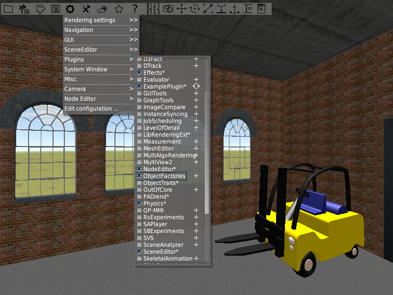

Open your saved scene.
Now open the object placer and drag an instance of _SimpleMotor_ (you can find it under the item _Basic object factories_) into the scene.

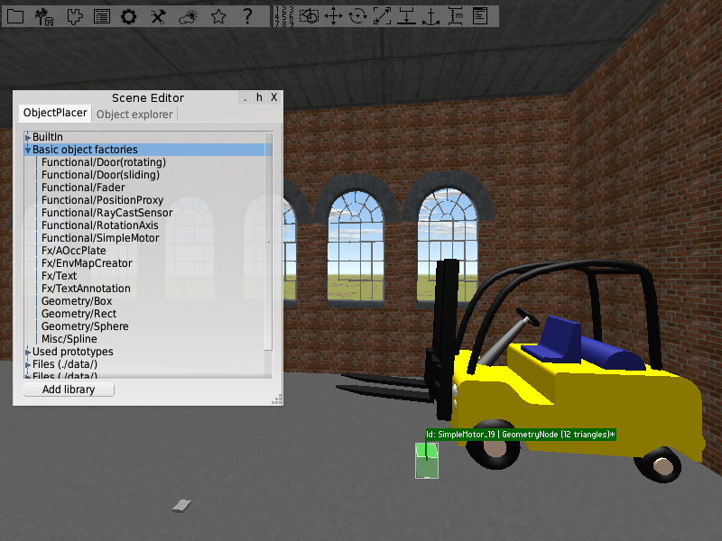

## Node links
To get the animation running we need to connect the motor to it.
Open the object explorer and expand the forklift.
To do so we add add a link to the motor.
Notice that each link has a role.
It describes the receiver of the link.
In our case the receiver is the animation and the role is called _animator_.
To add a link that drives the animation click on add link and choose _animator_.

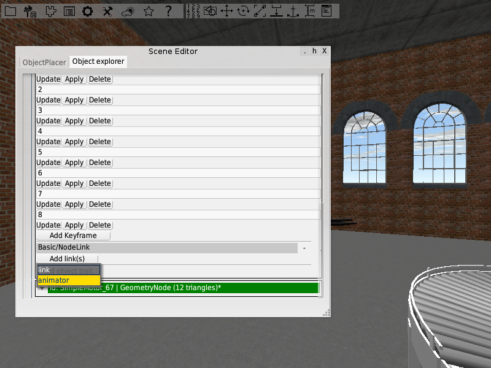

If the motor was selected the link is automatically created between the forklift and the motor (you can skip the next step in this case).
Otherwise you will find _self_ in the query text field.
In this case you have to select the motor and click the arrow beside the query text field.
Choose _Update from selected_ to establish the link.

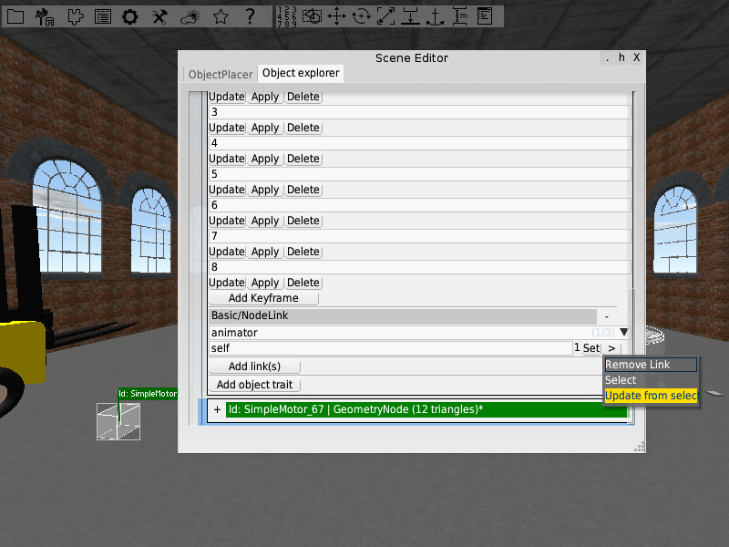

The text field underneath the role name shows you the target of the link.
It is formalized by a XPath query.
The query is used to find the target node in the scene graph.
It is always relative to the source node of the link.

## Starting the animation
Now expand the motors object in the object explorer.
It has three traits:
	* MetaObjectTrait: The motor is an meta object, so that it is only visible at layer \#3.
	* GeometryBox: The motor is box shaped.
	* ContinuousAnimator: As long as it is in play-state the motor drives animations.

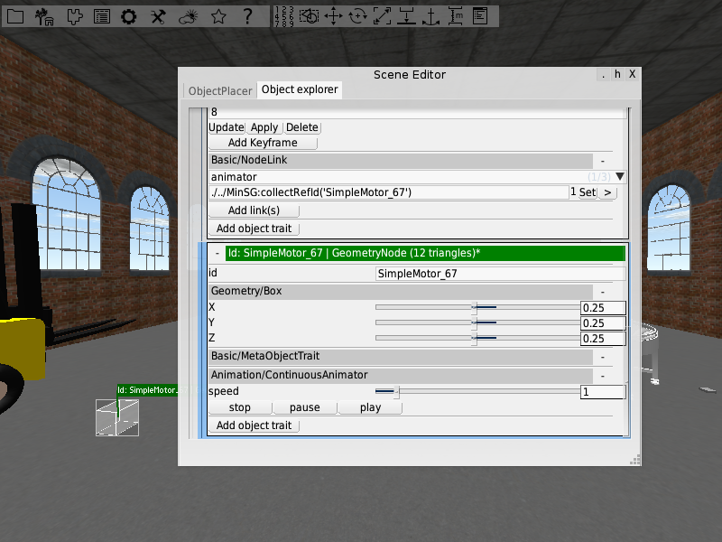

Click on the _play_ button and the forklift will start moving around.
To pause the animation use _pause_.
To reset the animation press _stop_.
In this way you can also restart the animation when it is finished.  
You can alter the speed of the animation by using speed slider in either the _ContinuousAnimator_ or the _KeyFrameAnimation_ trait.
Notice that several animations can be connected to one motor.
Altering the speed at the motor will effect all connected animations.  
You can use the _smoothness_ slider of the animation to get the animation begin slowly, then increase the speed, and decrease the speed at the end of a key frame again.
Activate _loop animation_ to get the key frame animation run in a loop.
In this way you can get the forklift move continuously around the production line.

## Starting the animation by clicking on the forklift
The forklift is moving, but starting the animation by clicking on the start button is a bit annoying.
We want the forklift to start moving when we click on it.
Add an _Animation/Button_ trait to the forklift.
The button trait has a text field _linkRole_.
Create a link to the motor by using the role name of the text field.
You can now start and pause the animation by clicking on the forklift.
If you want to stop the animation instead of pausing it, type in _animationStop_ into the _fn2_ text field.

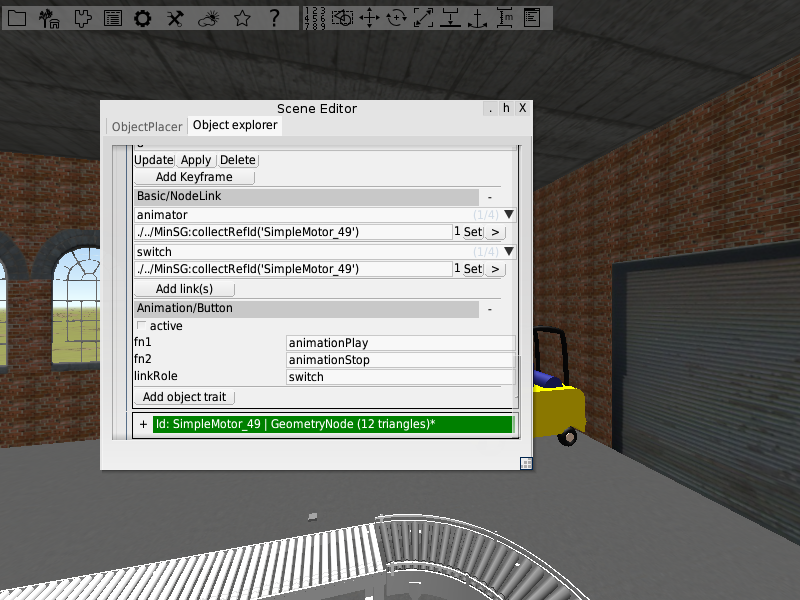
